## Table of Contents

- [Project Introduction](#page-intro)
- [Overall System Architecture](#page-arch-overview)
- [Main Server Architecture (Nest.js)](#page-main-server-arch)
- [Data Gateway Architecture (FastAPI)](#page-data-gateway-arch)
- [Crawler Sidecar Architecture (Go Colly)](#page-crawler-arch)
- [Sentiment Analysis Pipeline](#page-sentiment-pipeline)
- [User Authentication & Management](#page-auth)
- [Data Collection Mechanisms](#page-data-collection)
- [Database Schemas & Storage](#page-db-schema)
- [Analytics Dashboard & UI](#page-frontend-dashboard)
- [AI Models & Services](#page-ai-models)
- [Local Development & Deployment](#page-deployment)

<a id='page-intro'></a>

## Project Introduction

### Related Pages

Related topics: [Overall System Architecture](#page-arch-overview)

<details>
<summary>Relevant source files</summary>

- [main-server/src/swagger.ts](https://github.com/MRGLOBIN/FYP-Paksentiment/blob/main/main-server/src/swagger.ts)
- [frontend/src/hooks/useAnalytics.ts](https://github.com/MRGLOBIN/FYP-Paksentiment/blob/main/frontend/src/hooks/useAnalytics.ts)
- [frontend/src/app/components/AnalysisDashboard/useAnalysisDashboard.ts](https://github.com/MRGLOBIN/FYP-Paksentiment/blob/main/frontend/src/app/components/AnalysisDashboard/useAnalysisDashboard.ts)
- [new PakSentiment-data-gateway/services/scrapling_service.py](https://github.com/MRGLOBIN/FYP-Paksentiment/blob/main/new PakSentiment-data-gateway/services/scrapling_service.py)
- [main-server/test/app.e2e-spec.ts](https://github.com/MRGLOBIN/FYP-Paksentiment/blob/main/main-server/test/app.e2e-spec.ts)
- [frontend/src/types/index.ts](https://github.com/MRGLOBIN/FYP-Paksentiment/blob/main/frontend/src/types/index.ts)
</details>

# Project Introduction

PakSentiment is a comprehensive social media sentiment analysis platform designed to focus on Pakistani social discourse. It provides services for secure user authentication, data aggregation from various sources, and AI-powered sentiment classification. The platform supports multi-language analysis, including automatic language detection and translation, primarily for Urdu and English content. Its architecture is built as a middleware layer connecting a frontend application to a data gateway and AI services, ensuring a full pipeline from data collection to advanced analytics.
Sources: [main-server/src/swagger.ts:8-19](main-server/src/swagger.ts#L8-L19)

The project aims to deliver a robust solution for understanding public sentiment across different social media and web platforms. It integrates multiple technologies and services to handle data collection, processing, and visualization, offering features like secure user management, detailed sentiment breakdowns, and export capabilities for analysis results.
Sources: [main-server/src/swagger.ts:21-27](main-server/src/swagger.ts#L21-L27), [frontend/src/app/components/AnalysisDashboard/useAnalysisDashboard.ts:60-75](frontend/src/app/components/AnalysisDashboard/useAnalysisDashboard.ts#L60-L75)

## System Architecture

The PakSentiment platform employs a layered architecture, separating concerns across frontend, backend, data gateway, and external services. The main server acts as an intermediary, handling user authentication and proxying data requests to the FastAPI gateway.

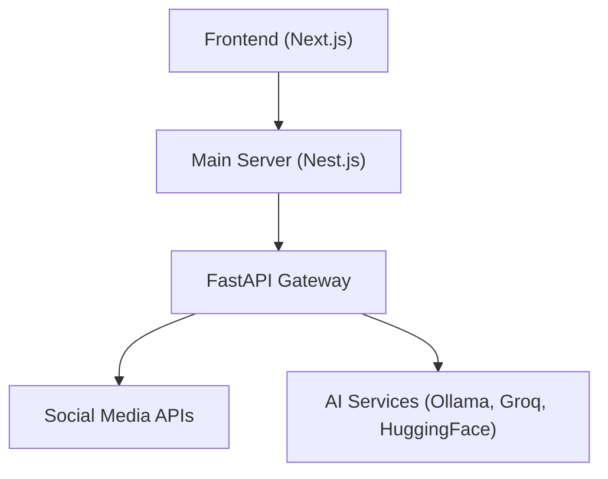
*PakSentiment High-Level Architecture*
Sources: [main-server/src/swagger.ts:31-34](main-server/src/swagger.ts#L31-L34)

### Component Overview

*   **Frontend (Next.js)**: The user interface for interacting with the platform. It initiates analysis requests and displays results.
    Sources: [main-server/src/swagger.ts:31](main-server/src/swagger.ts#L31), [frontend/src/hooks/useAnalytics.ts:1-200](frontend/src/hooks/useAnalytics.ts#L1-L200)
*   **Main Server (Nest.js)**: The primary backend, responsible for user authentication, authorization (JWT, OAuth), and routing requests to the data gateway. It also hosts the API documentation via Swagger.
    Sources: [main-server/src/swagger.ts:1-76](main-server/src/swagger.ts#L1-L76), [main-server/src/swagger.ts:21-22](main-server/src/swagger.ts#L21-L22), [main-server/test/app.e2e-spec.ts:121-164](main-server/test/app.e2e-spec.ts#L121-L164)
*   **FastAPI Gateway**: Acts as a data aggregation layer, interfacing with various social media APIs and AI services. It handles data collection, initial processing, and rate limiting.
    Sources: [main-server/src/swagger.ts:22-23](main-server/src/swagger.ts#L22-L23), [main-server/src/swagger.ts:46](main-server/src/swagger.ts#L46)
*   **Social Media APIs**: External services for collecting data from platforms like Reddit and Twitter.
    Sources: [main-server/src/swagger.ts:33](main-server/src/swagger.ts#L33), [frontend/src/hooks/useAnalytics.ts:133-145](frontend/src/hooks/useAnalytics.ts#L133-L145), [main-server/test/app.e2e-spec.ts:167-200](main-server/test/app.e2e-spec.ts#L167-L200)
*   **AI Services (Ollama, Groq, HuggingFace)**: External services for AI-powered sentiment classification and other intelligent processing.
    Sources: [main-server/src/swagger.ts:34](main-server/src/swagger.ts#L34), [frontend/src/hooks/useAnalytics.ts:182-183](frontend/src/hooks/useAnalytics.ts#L182-L183)

## Data Management

PakSentiment utilizes a dual-database strategy: PostgreSQL for managing users and configuration, and MongoDB for storing posts and analytical data.
Sources: [main-server/src/swagger.ts:26](main-server/src/swagger.ts#L26)

### Data Sources and Collection

The platform collects data from multiple sources to perform comprehensive sentiment analysis. This includes social media platforms, general web pages, and historical common crawl data.

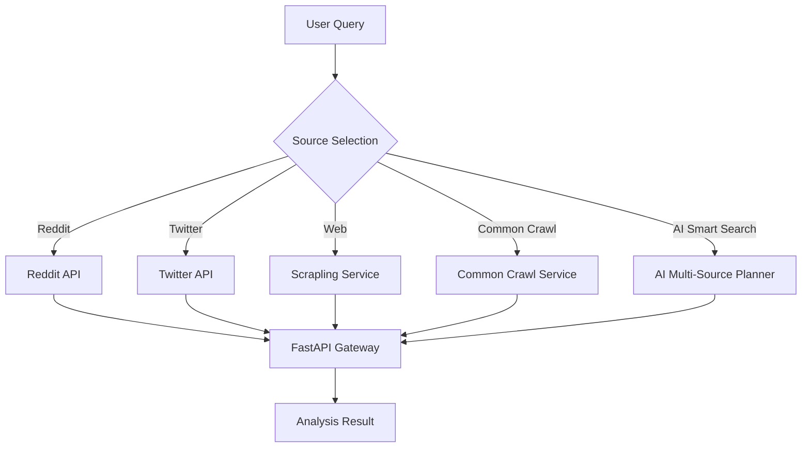
*Data Collection Flow*
Sources: [frontend/src/hooks/useAnalytics.ts:133-162](frontend/src/hooks/useAnalytics.ts#L133-L162), [frontend/src/hooks/useAnalytics.ts:182-200](frontend/src/hooks/useAnalytics.ts#L182-L200)

#### Web Data Collection (Scrapling)

The `ScraplingService` in the FastAPI data gateway is responsible for fetching and crawling web pages. It uses the `paksentiment_scraper` client to interact with web content.

**`ScraplingService.fetch_page` Method:**
This asynchronous method fetches a web page and can optionally follow links for deep crawling. It includes content cleaning to remove boilerplate text.
Sources: [new PakSentiment-data-gateway/services/scrapling_service.py:16-20](new%20PakSentiment-data-gateway/services/scrapling_service.py#L16-L20)

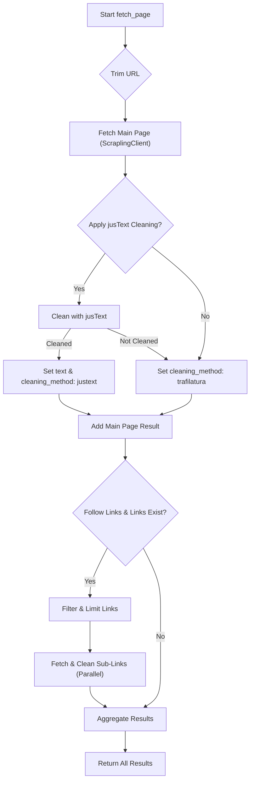
*Web Page Fetching and Crawling Logic*
Sources: [new PakSentiment-data-gateway/services/scrapling_service.py:32-34](new%20PakSentiment-data-gateway/services/scrapling_service.py#L32-L34), [new PakSentiment-data-gateway/services/scrapling_service.py:44-63](new%20PakSentiment-data-gateway/services/scrapling_service.py#L44-L63), [new PakSentiment-data-gateway/services/scrapling_service.py:70-74](new%20PakSentiment-data-gateway/services/scrapling_service.py#L70-L74)

| Parameter      | Type    | Description                                                 |
| :------------- | :------ | :---------------------------------------------------------- |
| `url`          | `str`   | The URL to fetch.                                           |
| `follow_links` | `bool`  | If `True`, recursively fetches links found on the page.     |
| `limit`        | `int`   | Maximum number of links to follow.                          |
| `clean_content`| `bool`  | If `True`, uses `jusText` to remove boilerplate.            |
Sources: [new PakSentiment-data-gateway/services/scrapling_service.py:23-28](new%20PakSentiment-data-gateway/services/scrapling_service.py#L23-L28)

#### Social Media Data Endpoints

The frontend `useAnalytics` hook interacts with specific endpoints on the main server to fetch social media data.
Sources: [frontend/src/hooks/useAnalytics.ts:133-145](frontend/src/hooks/useAnalytics.ts#L133-L145)

| Source             | Endpoint                      | Request Body Parameters                                     |
| :----------------- | :---------------------------- | :---------------------------------------------------------- |
| Reddit Sentiment   | `/raw-data/reddit/sentiment`  | `subreddit` (default 'pakistan'), `query` (default 'general'), `limit` (default 10), `customTags`, `overrideSessionId` |
| Twitter Sentiment  | `/raw-data/twitter/sentiment` | `query`, `maxResults` (default 10), `customTags`, `overrideSessionId` |
Sources: [frontend/src/hooks/useAnalytics.ts:133-145](frontend/src/hooks/useAnalytics.ts#L133-L145), [main-server/test/app.e2e-spec.ts:167-171](main-server/test/app.e2e-spec.ts#L167-L171), [main-server/test/app.e2e-spec.ts:104-108](main-server/test/app.e2e-spec.ts#L104-L108)

## Data Processing and Analysis

Once data is collected, it undergoes sentiment analysis and is then normalized for consistent display and further processing. The `AnalysisDashboard` component calculates Key Performance Indicators (KPIs) based on the analyzed data.

### Analysis Result Structure

The `AnalysisResult` and related types define the standardized format for data throughout the platform.
Sources: [frontend/src/types/index.ts:40-66](frontend/src/types/index.ts#L40-L66)

| Field         | Type                               | Description                                                      | Source File                                      |
| :------------ | :--------------------------------- | :--------------------------------------------------------------- | :----------------------------------------------- |
| `source`      | `string`                           | The origin of the analysis (e.g., 'reddit', 'twitter', 'web', 'ai'). | [frontend/src/types/index.ts:60](frontend/src/types/index.ts#L60)               |
| `count`       | `number`                           | Total number of items/posts analyzed.                            | [frontend/src/types/index.ts:61](frontend/src/types/index.ts#L61)               |
| `posts`       | `Post[]`                           | Array of individual posts or content items.                      | [frontend/src/types/index.ts:62](frontend/src/types/index.ts#L62)               |
| `sentiment`   | `SentimentResult[]`                | Array of sentiment analysis results for each item.               | [frontend/src/types/index.ts:63](frontend/src/types/index.ts#L63)               |
| `sessionId`   | `string?`                          | Optional unique identifier for an analysis session.              | [frontend/src/types/index.ts:64](frontend/src/types/index.ts#L64)               |
| `plan`        | `Record<string, unknown>[]?`       | Optional plan details for multi-source AI searches.              | [frontend/src/types/index.ts:65](frontend/src/types/index.ts#L65)               |

#### Post Interface (`Post`)

Represents a single content item collected from any source.
Sources: [frontend/src/types/index.ts:40-57](frontend/src/types/index.ts#L40-L57)

| Field          | Type                     | Description                                            |
| :------------- | :----------------------- | :----------------------------------------------------- |
| `id`           | `string`                 | Unique identifier for the post.                        |
| `title`        | `string`                 | Title of the post.                                     |
| `text`         | `string`                 | Main body text of the post.                            |
| `content`      | `string?`                | Alternative content field.                             |
| `author`       | `string`                 | Author of the post.                                    |
| `url`          | `string`                 | URL of the original post.                              |
| `timestamp`    | `string?`                | Timestamp of the post.                                 |
| `created_utc`  | `number`                 | UTC creation timestamp.                                |
| `date`         | `string \| number?`      | Date of the post.                                      |
| `sentiment`    | `string?`                | Overall sentiment label (e.g., 'Positive', 'Negative'). |
| `confidence`   | `number?`                | Confidence score of the sentiment.                     |
| `subreddit`    | `string`                 | Subreddit (for Reddit posts).                          |
| `score`        | `number`                 | Score or likes (for social media posts).               |
| `metadata`     | `Record<string, unknown>?` | Additional metadata.                                   |

#### Sentiment Result Interface (`SentimentResult`)

Details the outcome of sentiment analysis for a given content chunk or post.
Sources: [frontend/src/types/index.ts:29-37](frontend/src/types/index.ts#L29-L37)

| Field           | Type                     | Description                                               |
| :-------------- | :----------------------- | :-------------------------------------------------------- |
| `id`            | `string`                 | Identifier linking to the analyzed content.               |
| `sentiment`     | `string`                 | Classified sentiment (e.g., 'Positive', 'Negative', 'Neutral'). |
| `confidence`    | `number`                 | Confidence score of the sentiment classification.         |
| `summary`       | `string`                 | A brief summary or context of the sentiment.              |
| `topic`         | `string?`                | The detected topic of the content.                        |
| `engine`        | `string?`                | The AI engine used for sentiment analysis.                |
| `chunk_results` | `Record<string, unknown>[]?` | Detailed results if content was analyzed in chunks.       |

### Key Performance Indicators (KPIs)

The `useAnalysisDashboard` hook calculates various KPIs to summarize the analysis results.
Sources: [frontend/src/app/components/AnalysisDashboard/useAnalysisDashboard.ts:102-132](frontend/src/app/components/AnalysisDashboard/useAnalysisDashboard.ts#L102-L132)

*   **`totalDocs`**: Total number of documents or posts analyzed.
*   **`uniqueAuthors`**: Count of distinct authors.
*   **`topTopic`**: The most frequently occurring topic.
*   **`topTopicCount`**: Number of documents associated with the top topic.
*   **`topTopicPercent`**: Percentage of documents associated with the top topic.
*   **`avgConfidence`**: Average confidence score across all sentiment analyses.
*   **`topicCounts`**: Object mapping topics to their counts.
*   **`sentimentSource`**: Normalized list of sentiment results used for calculations.

## API and Authentication

The Main Server provides a RESTful API documented via Swagger. Access to most endpoints requires JWT authentication.
Sources: [main-server/src/swagger.ts:1-76](main-server/src/swagger.ts#L1-L76), [main-server/src/swagger.ts:38](main-server/src/swagger.ts#L38)

### Authentication Methods

Users can register, log in with email and password, or use OAuth (Google). Authentication tokens are obtained via specific endpoints.
Sources: [main-server/src/swagger.ts:21](main-server/src/swagger.ts#L21), [main-server/src/swagger.ts:39](main-server/src/swagger.ts#L39)

| Endpoint                          | Method | Description                                    |
| :-------------------------------- | :----- | :--------------------------------------------- |
| `/auth/register`                  | `POST` | Registers a new user and returns an access token. |
| `/auth/login-with-email-password` | `POST` | Authenticates a user and returns an access token. |
| `/auth/forgot-password`           | `POST` | Initiates a password reset request.            |
Sources: [main-server/src/swagger.ts:39](main-server/src/swagger.ts#L39), [main-server/test/app.e2e-spec.ts:121-164](main-server/test/app.e2e-spec.ts#L121-L164)

### API Documentation

Swagger UI is served at the `/api` path, providing interactive documentation for all available endpoints, including authentication requirements.
Sources: [main-server/src/swagger.ts:75](main-server/src/swagger.ts#L75)

### Rate Limits

Rate limiting is implemented at the FastAPI gateway level, incorporating automatic retry logic to handle high request volumes gracefully.
Sources: [main-server/src/swagger.ts:46](main-server/src/swagger.ts#L46)

## Conclusion

PakSentiment is structured as a multi-component system designed for comprehensive social media sentiment analysis, particularly for Pakistani discourse. Its architecture, encompassing a Next.js frontend, Nest.js main server, FastAPI data gateway, and external AI/social media services, facilitates robust data collection, processing, and analytical insights. The platform's commitment to secure authentication, multi-language support, and detailed data visualization underscores its utility for in-depth sentiment understanding.

---

<a id='page-arch-overview'></a>

## Overall System Architecture

### Related Pages

Related topics: [Project Introduction](#page-intro), [Main Server Architecture (Nest.js)](#page-main-server-arch), [Data Gateway Architecture (FastAPI)](#page-data-gateway-arch), [Crawler Sidecar Architecture (Go Colly)](#page-crawler-arch)

<details>
<summary>Relevant source files</summary>

The following files were used as context for generating this wiki page:

- [main-server/src/swagger.ts](https://github.com/MRGLOBIN/FYP-Paksentiment/blob/main/main-server/src/swagger.ts)
- [frontend/src/hooks/useAnalytics.ts](https://github.com/MRGLOBIN/FYP-Paksentiment/blob/main/frontend/src/hooks/useAnalytics.ts)
- [frontend/src/app/components/AnalysisDashboard/useAnalysisDashboard.ts](https://github.com/MRGLOBIN/FYP-Paksentiment/blob/main/frontend/src/app/components/AnalysisDashboard/useAnalysisDashboard.ts)
- [new PakSentiment-data-gateway/services/scrapling_service.py](https://github.com/MRGLOBIN/FYP-Paksentiment/blob/main/new%20PakSentiment-data-gateway/services/scrapling_service.py)
- [main-server/test/app.e2e-spec.ts](https://github.com/MRGLOBIN/FYP-Paksentiment/blob/main/main-server/test/app.e2e-spec.ts)
</details>

# Overall System Architecture

PakSentiment is a comprehensive social media sentiment analysis platform focused on Pakistani social discourse. Its architecture is designed to provide secure user authentication, aggregate data from various social media sources, and perform AI-powered sentiment classification. The system acts as a middleware layer, facilitating communication between the frontend user interface and external data sources or AI services.
Sources: [main-server/src/swagger.ts:8-14](main-server/src/swagger.ts#L8-L14)

## High-Level Architecture

The PakSentiment platform employs a layered architecture to separate concerns and enable scalable data processing. The core components include a Next.js frontend, a Nest.js main server, and a FastAPI data gateway that interacts with social media APIs and AI services.
Sources: [main-server/src/swagger.ts:16-19](main-server/src/swagger.ts#L16-L19)


*High-level architectural overview of the PakSentiment platform.*
Sources: [main-server/src/swagger.ts:16-19](main-server/src/swagger.ts#L16-L19)

## Main Server (Nest.js)

The Main Server, built with Nest.js, serves as the primary backend for the PakSentiment platform. It handles user authentication, acts as a proxy for data aggregation, and orchestrates the sentiment analysis pipeline.

### Purpose and Features

The main server provides secure authentication and data aggregation services. Key features include:
*   **User Authentication**: Secure registration, login, and OAuth (Google) integration.
*   **Data Aggregation**: Proxy endpoints to the FastAPI gateway for Reddit and Twitter data.
*   **Sentiment Analysis**: Facilitates the full pipeline from data collection to AI-powered sentiment classification.
*   **Multi-language Support**: Supports automatic language detection and translation (Urdu, English, etc.).
*   **Database Management**: Utilizes PostgreSQL for user data and configuration, and MongoDB for posts and analytics (as described in the overall platform features).
Sources: [main-server/src/swagger.ts:10-14](main-server/src/swagger.ts#L10-L14)

### API Endpoints and Authentication

The Main Server exposes a RESTful API with endpoints for authentication and data operations. Most endpoints require JWT authentication.
Sources: [main-server/src/swagger.ts:21-25](main-server/src/swagger.ts#L21-L25)

**Authentication Flow:**
Users obtain an access token by registering via `/auth/register` or logging in with email and password via `/auth/login-with-email-password`. This token is then used in the `Authorization` header as a Bearer token.
Sources: [main-server/src/swagger.ts:21-25](main-server/src/swagger.ts#L21-L25)

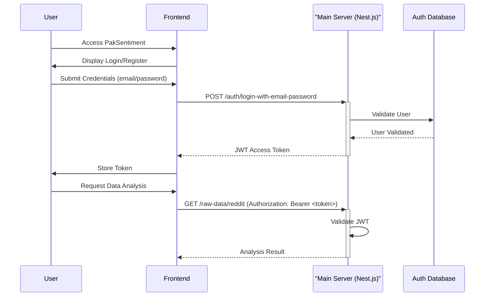
*Sequence diagram for user authentication and subsequent API calls.*

**API Endpoint Categories:**
The API documentation categorizes endpoints using tags for clarity:

| Tag            | Description                                   |
| :------------- | :-------------------------------------------- |
| Authentication | User registration, login, and OAuth endpoints |
| Reddit         | Reddit data collection and sentiment analysis |
| Twitter        | Twitter data collection and sentiment analysis |
| Health         | API health check endpoints                    |
Sources: [main-server/src/swagger.ts:64-68](main-server/src/swagger.ts#L64-L68)

### Main Server E2E Tests

End-to-end tests for the Main Server confirm the functionality of key API endpoints.
Sources: [main-server/test/app.e2e-spec.ts:80-137](main-server/test/app.e2e-spec.ts#L80-L137)

**Tested Endpoints:**
*   `/auth/register` (POST): Validates user registration.
*   `/auth/login-with-email-password` (POST): Validates user login and token generation.
*   `/auth/forgot-password` (POST): Tests password reset request processing.
*   `/raw-data/reddit` (POST): Verifies fetching Reddit posts.
*   `/raw-data/twitter/sentiment` (POST): Checks fetching Twitter data and sentiment.
*   `/` (GET): Health check for the root endpoint.
Sources: [main-server/test/app.e2e-spec.ts:80-137](main-server/test/app.e2e-spec.ts#L80-L137)

## FastAPI Data Gateway

The FastAPI Data Gateway acts as an intermediary, receiving requests from the Main Server and routing them to appropriate external services for data collection, cleaning, and AI processing. Rate limiting is handled at this gateway level with automatic retry logic.
Sources: [main-server/src/swagger.ts:40](main-server/src/swagger.ts#L40)

### Web Scraping Service (`ScraplingService`)

The `ScraplingService` within the FastAPI gateway is responsible for interacting with generic web pages, supporting single page fetching and deep crawling.
Sources: [new PakSentiment-data-gateway/services/scrapling_service.py:14-17](new%20PakSentiment-data-gateway/services/scrapling_service.py#L14-L17)

**Key Function: `fetch_page`**
This asynchronous method fetches a web page and optionally follows links. It applies content cleaning to remove boilerplate.
Sources: [new PakSentiment-data-gateway/services/scrapling_service.py:20-27](new%20PakSentiment-data-gateway/services/scrapling_service.py#L20-L27)

| Parameter      | Type      | Description                                                    |
| :------------- | :-------- | :------------------------------------------------------------- |
| `url`          | `str`     | The URL to fetch.                                              |
| `follow_links` | `bool`    | If `True`, recursively fetch links found on the page.          |
| `limit`        | `int`     | Maximum number of links to follow.                             |
| `clean_content`| `bool`    | If `True`, use `jusText` to remove boilerplate. Default is `True`. |
Sources: [new PakSentiment-data-gateway/services/scrapling_service.py:28-31](new%20PakSentiment-data-gateway/services/scrapling_service.py#L28-L31)

**Content Cleaning:**
The service attempts to clean the content using `clean_with_justext`. If `jusText` is successful, the `cleaning_method` is set to `"justext"`; otherwise, it falls back to `"trafilatura_fallback"`.
Sources: [new PakSentiment-data-gateway/services/scrapling_service.py:43-50](new%20PakSentiment-data-gateway/services/scrapling_service.py#L43-L50)

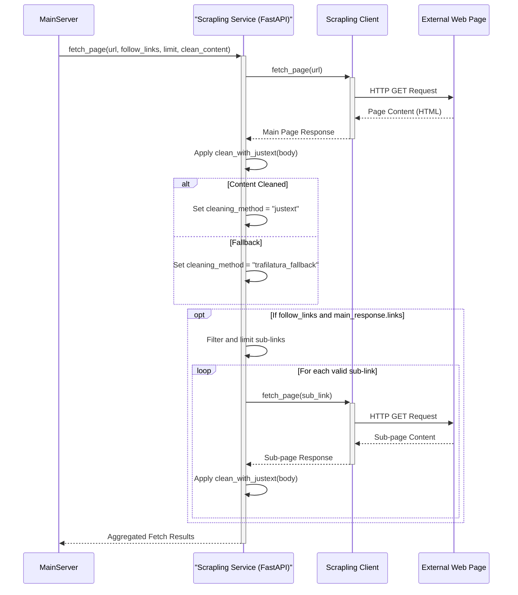
*Flow of the `fetch_page` operation within the `ScraplingService`.*
Sources: [new PakSentiment-data-gateway/services/scrapling_service.py:35-74](new%20PakSentiment-data-gateway/services/scrapling_service.py#L35-L74)

### Data Sources & Smart Search

The FastAPI gateway integrates with various data sources and offers a "smart search" capability.
Sources: [frontend/src/hooks/useAnalytics.ts:98-124](frontend/src/hooks/useAnalytics.ts#L98-L124)

**Supported Analysis Sources (via Main Server proxy to FastAPI):**
*   `reddit_sentiment`: Queries Reddit for sentiment analysis. Endpoint: `/raw-data/reddit/sentiment`.
*   `twitter_sentiment`: Queries Twitter for sentiment analysis. Endpoint: `/raw-data/twitter/sentiment`.
*   `web`: Fetches and analyzes content from specified URLs. Endpoint: `/raw-data/web`.
*   `ai`: Initiates a multi-source "smart search" for comprehensive analysis. Endpoint: `/raw-data/smart`.
Sources: [frontend/src/hooks/useAnalytics.ts:98-124](frontend/src/hooks/useAnalytics.ts#L98-L124)

**AI Smart Search:**
The `ai` source triggers a multi-source search that plans data collection from Reddit, Web Search, and Common Crawl. This is handled by the `/raw-data/smart` endpoint on the FastAPI gateway.
Sources: [frontend/src/hooks/useAnalytics.ts:132-155](frontend/src/hooks/useAnalytics.ts#L132-L155)

## Frontend (Next.js)

The frontend, built with Next.js, provides the user interface for interacting with the PakSentiment platform, allowing users to initiate analysis, view results, and export reports.

### Analytics Workflow (`useAnalytics` hook)

The `useAnalytics` React hook manages the state and logic for initiating sentiment analysis queries from the frontend. It orchestrates API calls to the Main Server based on user input.
Sources: [frontend/src/hooks/useAnalytics.ts:1-96](frontend/src/hooks/useAnalytics.ts#L1-L96)

**Key Function: `runAnalysis`**
This function executes the sentiment analysis based on the selected source and query.

**Multi-URL Processing for Web Source:**
When the source is `web` and `multiUrlMode` is enabled, the `runAnalysis` function processes multiple URLs in a batch. A `masterSessionId` is generated to link all results from a single batch analysis. Each URL is processed sequentially, and results are merged.
Sources: [frontend/src/hooks/useAnalytics.ts:35-37](frontend/src/hooks/useAnalytics.ts#L35-L37), [frontend/src/hooks/useAnalytics.ts:55-75](frontend/src/hooks/useAnalytics.ts#L55-L75), [frontend/src/hooks/useAnalytics.ts:157-183](frontend/src/hooks/useAnalytics.ts#L157-L183)

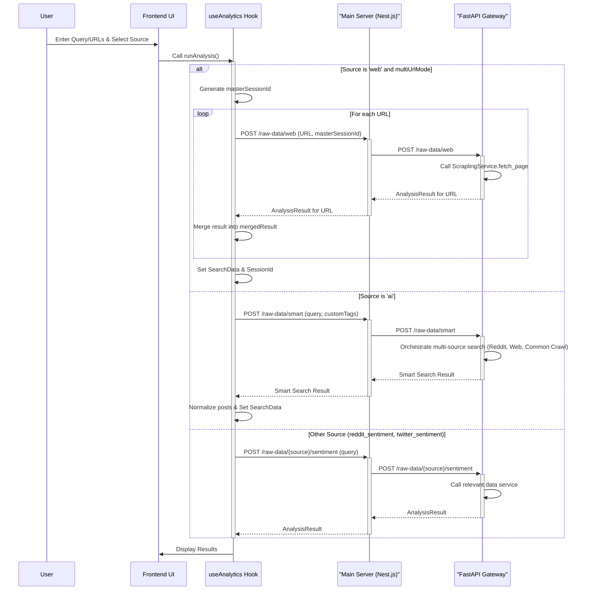
*Workflow of the `runAnalysis` function for different data sources.*
Sources: [frontend/src/hooks/useAnalytics.ts:35-75](frontend/src/hooks/useAnalytics.ts#L35-L75), [frontend/src/hooks/useAnalytics.ts:126-183](frontend/src/hooks/useAnalytics.ts#L126-L183)

### Analysis Dashboard (`useAnalysisDashboard` hook)

The `useAnalysisDashboard` hook is responsible for processing the raw analysis results (`AnalysisResult`) received from the backend, calculating key performance indicators (KPIs), generating data for charts, and enabling export functionalities.
Sources: [frontend/src/app/components/AnalysisDashboard/useAnalysisDashboard.ts:153-270](frontend/src/app/components/AnalysisDashboard/useAnalysisDashboard.ts#L153-L270)

**Key Performance Indicators (KPIs):**
The hook calculates several KPIs based on the analysis data:

| KPI                 | Description                                                                 |
| :------------------ | :-------------------------------------------------------------------------- |
| `totalDocs`         | Total number of documents analyzed.                                         |
| `uniqueAuthors`     | Number of unique authors identified in the posts.                           |
| `topTopic`          | The most frequently occurring sentiment category.                           |
| `topTopicCount`     | The count of posts for the top topic.                                       |
| `topTopicPercent`   | The percentage of posts for the top topic relative to total documents.      |
| `avgConfidence`     | Average confidence score across all sentiment classifications.              |
Sources: [frontend/src/app/components/AnalysisDashboard/useAnalysisDashboard.ts:167-184](frontend/src/app/components/AnalysisDashboard/useAnalysisDashboard.ts#L167-L184)

**Export Functionality:**
The dashboard supports exporting analysis results in two formats: CSV and PDF.
Sources: [frontend/src/app/components/AnalysisDashboard/useAnalysisDashboard.ts:60-125](frontend/src/app/components/AnalysisDashboard/useAnalysisDashboard.ts#L60-L125)

*   **CSV Export (`handleExportCSV`)**: Generates a CSV file containing `Date`, `Source`, `User Name`, `Content`, `Sentiment`, `Context/Topic`, `Confidence`, and `URL` for each post.
    Sources: [frontend/src/app/components/AnalysisDashboard/useAnalysisDashboard.ts:60-77](frontend/src/app/components/AnalysisDashboard/useAnalysisDashboard.ts#L60-L77)
*   **PDF Export (`handleExportPDF`)**: Utilizes `jsPDF` and `jspdf-autotable` to create a PDF report. The PDF includes a header with "DataInsight Analysis Report", generation date, source, and document count. It presents a table with key post details.
    Sources: [frontend/src/app/components/AnalysisDashboard/useAnalysisDashboard.ts:80-125](frontend/src/app/components/AnalysisDashboard/useAnalysisDashboard.ts#L80-L125)

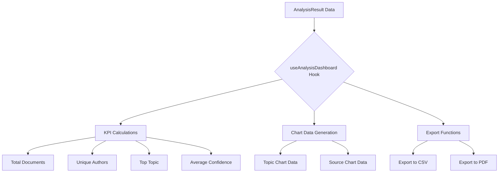
*Data flow within the `useAnalysisDashboard` hook.*
Sources: [frontend/src/app/components/AnalysisDashboard/useAnalysisDashboard.ts:153-270](frontend/src/app/components/AnalysisDashboard/useAnalysisDashboard.ts#L153-L270)

## Conclusion

The PakSentiment system architecture is composed of a Next.js frontend, a Nest.js main server, and a FastAPI data gateway, integrating various social media APIs and AI services. This structure enables robust user authentication, efficient data aggregation, advanced sentiment analysis, and flexible reporting through a modular and scalable design.

---

<a id='page-main-server-arch'></a>

## Main Server Architecture (Nest.js)

### Related Pages

Related topics: [Overall System Architecture](#page-arch-overview), [Database Schemas & Storage](#page-db-schema), [User Authentication & Management](#page-auth)

<details>
<summary>Relevant source files</summary>

The following files were used as context for generating this wiki page:

- [main-server/src/main.ts](https://github.com/MRGLOBIN/FYP-Paksentiment/blob/main/main-server/src/main.ts)
- [main-server/src/swagger.ts](https://github.com/MRGLOBIN/FYP-Paksentiment/blob/main/main-server/src/swagger.ts)
- [main-server/test/app.e2e-spec.ts](https://github.com/MRGLOBIN/FYP-Paksentiment/blob/main/main-server/test/app.e2e-spec.ts)
- [main-server/src/app.controller.spec.ts](https://github.com/MRGLOBIN/FYP-Paksentiment/blob/main/main-server/src/app.controller.spec.ts)
- [new PakSentiment-data-gateway/services/scrapling_service.py](https://github.com/MRGLOBIN/FYP-Paksentiment/blob/main/new%20PakSentiment-data-gateway/services/scrapling_service.py)
</details>

# Main Server Architecture (Nest.js)

The PakSentiment Main Server is a Nest.js backend application designed to act as a central hub for the platform. Its primary purpose is to provide secure user authentication, manage core application configurations, and serve as a data aggregation layer by proxying requests to a downstream FastAPI data gateway. This architecture enables a robust and scalable foundation for social media sentiment analysis, specifically tailored for Pakistani social discourse. Sources: [main-server/src/swagger.ts:10-18](main-server/src/swagger.ts#L10-L18)

The server integrates various features, including secure registration and login, OAuth (Google) integration, and the orchestration of sentiment analysis workflows from data collection to AI-powered classification. It supports multi-language processing (Urdu, English) and utilizes PostgreSQL for user and configuration data, while MongoDB is used for posts and analytics. Sources: [main-server/src/swagger.ts:20-27](main-server/src/swagger.ts#L20-L27)

## Application Bootstrap and Configuration

The Nest.js application is initialized in `main.ts`, which serves as the entry point for the server. It configures essential middleware and services before starting the HTTP listener. Sources: [main-server/src/main.ts:1-24](main-server/src/main.ts#L1-L24)

### Bootstrap Process Flow

The following diagram illustrates the sequence of operations during the application startup:

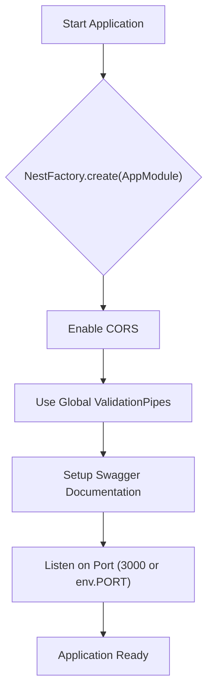
Sources: [main-server/src/main.ts:7-24](main-server/src/main.ts#L7-L24)

### Key Configurations

*   **CORS (Cross-Origin Resource Sharing):** Enabled for specific origins (`http://localhost:3001`, `http://localhost:3000`) allowing `GET, HEAD, PUT, PATCH, POST, DELETE, OPTIONS` methods with credentials. Sources: [main-server/src/main.ts:10-14](main-server/src/main.ts#L10-L14)
*   **Global Validation Pipes:** The `ValidationPipe` is applied globally to enforce data validation across all incoming requests. It is configured to `whitelist` (strip properties not defined in DTOs), `forbidNonWhitelisted` (throw errors for non-whitelisted properties), and `transform` (automatically convert incoming payload objects to DTO instances). Sources: [main-server/src/main.ts:17-22](main-server/src/main.ts#L17-L22), [main-server/test/app.e2e-spec.ts:23-28](main-server/test/app.e2e-spec.ts#L23-L28)
*   **Port:** The server listens on the port specified by the `PORT` environment variable, defaulting to `3000` if not set. Sources: [main-server/src/main.ts:24](main-server/src/main.ts#L24)

## API Documentation with Swagger

The Main Server provides comprehensive API documentation through Swagger (OpenAPI). The `setupSwagger` function in `swagger.ts` configures and integrates Swagger UI into the application. Sources: [main-server/src/swagger.ts:3-7](main-server/src/swagger.ts#L3-L7)

### Swagger Configuration Details

The `DocumentBuilder` is used to define the API's metadata and security schemes:

```typescript
// main-server/src/swagger.ts
const config = new DocumentBuilder()
    .setTitle('PakSentiment API Documentation')
    .setDescription(...) // Detailed API description
    .setTermsOfService('https://paksentiment.com/terms')
    .setContact('PakSentiment Team', 'https://paksentiment.com', 'support@paksentiment.com')
    .setLicense('MIT License', 'https://opensource.org/licenses/MIT')
    .addServer('http://localhost:3000', 'Development Server')
    .addServer('https://api.paksentiment.com', 'Production Server')
    .addBearerAuth(
        {
            type: 'http',
            scheme: 'bearer',
            bearerFormat: 'JWT',
            description: 'Enter your JWT token',
        },
        'JWT-auth',
    )
    .addTag('Authentication', 'User registration, login, and OAuth endpoints')
    .addTag('Reddit', 'Reddit data collection and sentiment analysis')
    .addTag('Twitter', 'Twitter data collection and sentiment analysis')
    .addTag('Health', 'API health check endpoints')
    .setVersion('1.0.0')
    .build();
```
Sources: [main-server/src/swagger.ts:9-81](main-server/src/swagger.ts#L9-L81)

The documentation includes:
*   **Title and Description:** "PakSentiment API Documentation" with a detailed overview of features, architecture, authentication, response format, and rate limits. Sources: [main-server/src/swagger.ts:10-53](main-server/src/swagger.ts#L10-L53)
*   **Servers:** Defines development (`http://localhost:3000`) and production (`https://api.paksentiment.com`) API endpoints. Sources: [main-server/src/swagger.ts:65-66](main-server/src/swagger.ts#L65-L66)
*   **Authentication:** Specifies JWT Bearer Token authentication (`JWT-auth` scheme) for protected endpoints. Sources: [main-server/src/swagger.ts:67-74](main-server/src/swagger.ts#L67-L74)
*   **Tags:** Organizes endpoints into categories such as 'Authentication', 'Reddit', 'Twitter', and 'Health'. Sources: [main-server/src/swagger.ts:75-78](main-server/src/swagger.ts#L75-L78)

### Overall Architecture Diagram

The documentation explicitly outlines the system's architecture:


Sources: [main-server/src/swagger.ts:29-33](main-server/src/swagger.ts#L29-L33)

## Authentication and Authorization

The Main Server handles user authentication, providing endpoints for user registration, login, and password management. Most API endpoints require JWT authentication. Sources: [main-server/src/swagger.ts:20-21, 35](main-server/src/swagger.ts#L20-L21,%2035)

### Authentication Flow (Example: Login)

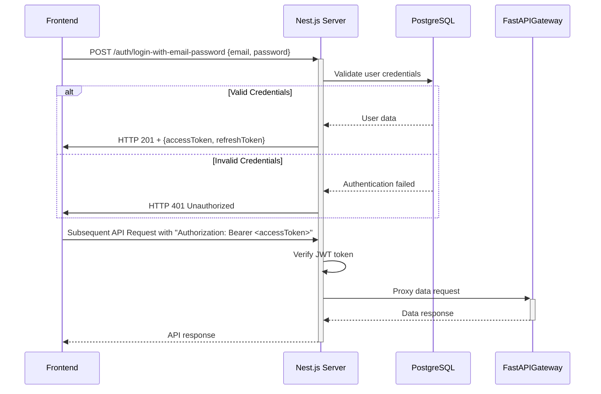
Sources: [main-server/src/swagger.ts:35-39](main-server/src/swagger.ts#L35-L39), [main-server/test/app.e2e-spec.ts:61-75](main-server/test/app.e2e-spec.ts#L61-L75)

### Authentication Endpoints

| Endpoint                               | Method | Description                                                               | Expected Status |
| :------------------------------------- | :----- | :------------------------------------------------------------------------ | :-------------- |
| `/auth/register`                       | POST   | Registers a new user with first name, last name, email, and password.     | 201 (Success), 400 (Invalid input, email exists, password mismatch) |
| `/auth/login-with-email-password`      | POST   | Authenticates a user with email and password, returning JWT tokens.       | 201 (Success), 401 (Unauthorized) |
| `/auth/forgot-password`                | POST   | Initiates a password reset request for a given email.                     | 201 (Success), 400 (Invalid email format) |
Sources: [main-server/test/app.e2e-spec.ts:46-105](main-server/test/app.e2e-spec.ts#L46-L105)

## Data Aggregation and Raw Data Endpoints

The Main Server acts as a proxy for data aggregation, forwarding requests to the FastAPI Gateway for social media data collection and sentiment analysis. Sources: [main-server/src/swagger.ts:22-23](main-server/src/swagger.ts#L22-L23)

### Raw Data Endpoints

| Endpoint                         | Method | Description                                                      | Parameters                                                                   | Expected Response Content |
| :------------------------------- | :----- | :--------------------------------------------------------------- | :--------------------------------------------------------------------------- | :------------------------ |
| `/raw-data/reddit`               | POST   | Fetches Reddit posts based on subreddit and query.               | `subreddit` (string), `query` (string), `limit` (number)                     | `posts` (array)           |
| `/raw-data/twitter/sentiment`    | POST   | Fetches Twitter data and performs sentiment analysis.            | `query` (string), `maxResults` (number)                                      | `tweets`, `translations`, `sentiment` |
Sources: [main-server/test/app.e2e-spec.ts:110-155](main-server/test/app.e2e-spec.ts#L110-L155)

These endpoints require a valid JWT `Authorization` header. The system handles rate limiting at the FastAPI gateway level with automatic retry logic. Sources: [main-server/src/swagger.ts:51-53](main-server/src/swagger.ts#L51-L53), [main-server/test/app.e2e-spec.ts:127-129](main-server/test/app.e2e-spec.ts#L127-L129)

### Downstream Data Gateway Interaction

The FastAPI Gateway, which the Nest.js server proxies to, is responsible for interacting with external services like social media APIs and performing data processing. An example of a service within the FastAPI Gateway is `ScraplingService`, which fetches and cleans web pages. Sources: [new PakSentiment-data-gateway/services/scrapling_service.py:20-21](new%20PakSentiment-data-gateway/services/scrapling_service.py#L20-L21)

```python
# new PakSentiment-data-gateway/services/scrapling_service.py
class ScraplingService:
    def __init__(self, client: ScraplingClient):
        self.client = client

    async def fetch_page(
        self,
        url: str,
        follow_links: bool,
        limit: int,
        clean_content: bool = True
    ) -> Dict[str, Any]:
        # 1. Fetch Main Page
        main_response = await asyncio.to_thread(self.client.fetch_page, url)
        result_dict = msgspec.to_builtins(main_response)

        # Apply jusText cleaning if requested
        if clean_content and main_response.body:
            cleaned_text = clean_with_justext(main_response.body)
            if cleaned_text:
                result_dict["text"] = cleaned_text
                result_dict["cleaning_method"] = "justext"
            else:
                result_dict["cleaning_method"] = "trafilatura_fallback"
        else:
            result_dict["cleaning_method"] = "trafilatura"

        results = [result_dict]

        # 2. Follow Links (Deep Fetch)
        if follow_links and main_response.links:
            valid_links = [l for l in main_response.links if l.startswith("http") and l != url]
            valid_links = list(set(valid_links))[:limit]
            
            async def fetch_and_clean(link: str):
                resp = await asyncio.to_thread(self.client.fetch_page, link)
                r_dict = msgspec.to_builtins(resp)
                if clean_content and resp.body:
                    c_text = clean_with_justext(resp.body)
                    if c_text:
                        r_dict["text"] = c_text
                        r_dict["cleaning_method"] = "justext"
                    else:
                        r_dict["cleaning_method"] = "trafilatura_fallback"
                return r_dict

            tasks = [fetch_and_clean(link) for link in valid_links]
            if tasks:
                sub_results = await asyncio.gather(*tasks)
                results.extend(sub_results)
        
        return {"main_page": results[0], "sub_pages": results[1:]} # Simplified return for wiki
```
Sources: [new PakSentiment-data-gateway/services/scrapling_service.py:28-98](new%20PakSentiment-data-gateway/services/scrapling_service.py#L28-L98)

This `ScraplingService` demonstrates the data collection capabilities available through the FastAPI gateway, which the Nest.js Main Server utilizes for web data analysis. It supports fetching a main page, optionally cleaning its content with `jusText`, and recursively following and cleaning sub-links up to a specified limit. Sources: [new PakSentiment-data-gateway/services/scrapling_service.py:28-98](new%20PakSentiment-data-gateway/services/scrapling_service.py#L28-L98)

## Testing Strategy

The Main Server employs both unit and end-to-end (e2e) testing to ensure reliability and correctness.

### Unit Testing

Unit tests focus on individual components, such as controllers, in isolation.
An example is `app.controller.spec.ts`, which tests the `AppController`'s `getHello` method. Sources: [main-server/src/app.controller.spec.ts:1-19](main-server/src/app.controller.spec.ts#L1-L19)

```typescript
// main-server/src/app.controller.spec.ts
describe('AppController', () => {
  let appController: AppController;

  beforeEach(async () => {
    const app: TestingModule = await Test.createTestingModule({
      controllers: [AppController],
      providers: [AppService],
   }).compile();

    appController = app.get<AppController>(AppController);
  });

  describe('root', () => {
    it('should return "Hello World!"', () => {
      expect(appController.getHello()).toBe('Hello World!');
    });
  });
});
```
Sources: [main-server/src/app.controller.spec.ts:6-19](main-server/src/app.controller.spec.ts#L6-L19)

### End-to-End (E2E) Testing

E2E tests simulate real-world user scenarios by making HTTP requests to the running application and asserting the responses. `app.e2e-spec.ts` uses `supertest` to test various API endpoints. Sources: [main-server/test/app.e2e-spec.ts:1-17](main-server/test/app.e2e-spec.ts#L1-L17)

### E2E Test Setup

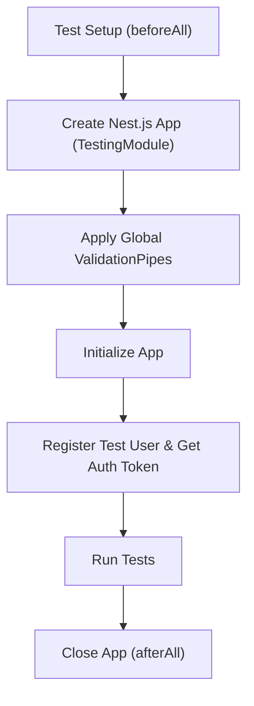
Sources: [main-server/test/app.e2e-spec.ts:14-41](main-server/test/app.e2e-spec.ts#L14-L41)

E2E tests cover:
*   **Authentication Endpoints:** Verifies user registration, login, and password reset functionality, including input validation. Sources: [main-server/test/app.e2e-spec.ts:44-105](main-server/test/app.e2e-spec.ts#L44-L105)
*   **Raw Data Endpoints:** Tests the proxy functionality for Reddit and Twitter data collection, ensuring correct parameters and authentication. It also handles potential `500` errors if the FastAPI gateway is unavailable. Sources: [main-server/test/app.e2e-spec.ts:108-155](main-server/test/app.e2e-spec.ts#L108-L155)
*   **API Health:** Checks the root endpoint for basic server responsiveness. Sources: [main-server/test/app.e2e-spec.ts:158-161](main-server/test/app.e2e-spec.ts#L158-L161)

## Conclusion

The PakSentiment Main Server, built with Nest.js, forms the core backend of the sentiment analysis platform. It provides robust authentication, serves as a crucial middleware for data aggregation from various sources via a FastAPI gateway, and exposes a well-documented API through Swagger. Its architecture is designed for extensibility and maintainability, supported by a comprehensive testing strategy that covers both unit and end-to-end functionality.

---

<a id='page-data-gateway-arch'></a>

## Data Gateway Architecture (FastAPI)

### Related Pages

Related topics: [Overall System Architecture](#page-arch-overview), [Sentiment Analysis Pipeline](#page-sentiment-pipeline), [Data Collection Mechanisms](#page-data-collection), [AI Models & Services](#page-ai-models)

<details>
<summary>Relevant source files</summary>

The following files were used as context for generating this wiki page:

- [new PakSentiment-data-gateway/main.py](https://github.com/MRGLOBIN/FYP-Paksentiment/blob/main/new%20PakSentiment-data-gateway/main.py)
- [new PakSentiment-data-gateway/routes/reddit.py](https://github.com/MRGLOBIN/FYP-Paksentiment/blob/main/new%20PakSentiment-data-gateway/routes/reddit.py)
- [new PakSentiment-data-gateway/routes/sentiment.py](https://github.com/MRGLOBIN/FYP-Paksentiment/blob/main/new%20PakSentiment-data-gateway/routes/sentiment.py)
- [new PakSentiment-data-gateway/services/sentiment_classifier.py](https://github.com/MRGLOBIN/FYP-Paksentiment/blob/main/new%20PakSentiment-data-gateway/services/sentiment_classifier.py)
- [new PakSentiment-data-gateway/services/translation.py](https://github.com/MRGLOBIN/FYP-Paksentiment/blob/main/new%20PakSentiment-data-gateway/services/translation.py)
- [new PakSentiment-data-gateway/services/scrapling_service.py](https://github.com/MRGLOBIN/FYP-Paksentiment/blob/main/new%20PakSentiment-data-gateway/services/scrapling_service.py)
</details>

# Data Gateway Architecture (FastAPI)

The FastAPI Gateway serves as a critical middleware layer within the PakSentiment platform, primarily responsible for data aggregation, sentiment analysis, and translation services. It acts as an intermediary between the main Nest.js backend server and various external data sources (e.g., social media APIs, web scrapers) and AI services (e.g., Hugging Face models for sentiment and translation).

This gateway handles raw data collection, processes it through AI-powered sentiment classification and language translation, and then delivers structured results back to the main server. It is designed to be highly performant, leveraging FastAPI's asynchronous capabilities to manage concurrent requests for data processing.

## Overall System Integration

The FastAPI Gateway is positioned between the Nest.js Main Server and external data/AI providers. This architecture allows the main server to offload intensive data processing and external API interactions to the gateway.


*Sources: [main-server/src/swagger.ts:28-31](main-server/src/swagger.ts#L28-L31)*

## Core Components

The FastAPI Gateway is structured around FastAPI application instantiation, API routers for endpoint definition, and various services encapsulating business logic and external integrations.

### FastAPI Application Setup

The main application is initialized using FastAPI, configured with CORS middleware to handle cross-origin requests. Routers for specific functionalities (e.g., Reddit, Sentiment) are included to organize endpoints.

```python
# new PakSentiment-data-gateway/main.py
import logging
from fastapi import FastAPI
from fastapi.middleware.cors import CORSMiddleware
from routes import reddit, sentiment

logging.basicConfig(level=logging.INFO)
logger = logging.getLogger(__name__)

app = FastAPI()

app.add_middleware(
    CORSMiddleware,
    allow_origins=["*"],
    allow_credentials=True,
    allow_methods=["*"],
    allow_headers=["*"],
)

app.include_router(reddit.router, prefix="/raw-data")
app.include_router(sentiment.router, prefix="/raw-data")
```
*Sources: [new PakSentiment-data-gateway/main.py:3-20](new%20PakSentiment-data-gateway/main.py#L3-L20)*

### Services

The gateway utilizes several services to abstract specific functionalities, making the codebase modular and maintainable.

| Service                       | Description                                                                                                                                                                                                                                                                                                                                                                                                                                                                                                                                                                                                                                                                                                                                                                                                                                                                                                                                                                                                                                                                                                                                                                                                                                                                                                                                                                                                                                                                                                                                                                                                                                                                                                                                                                                                                                                                                                                                                                                                                                                                                                                                                                                                                                                                                                                                                                                                                                                                                                                                                                                                                                                                                                                                                                                                                                                                                                                                                                                                                                                                                                                                                                                                                                                                                                                                                                                                                                                                                                                                                                                                                                                                                                                                                                                                                                                                                                                                                                                                                                                                                                                                                                                                                                                                                                                                                                                                                                                                                                                                                                                                                                                                                                                                                                                                                                                                                                                                                                                                                                                                                                                                                                                                                                                                                                                                                                                                                                                                                                                                                                                                                                                                                                                                                                                                                                                                                                                                                                                                                                                                                                                                                                                                                                                                                                                                                                                                                                                                                                                                                                                                                                                                                                                                                                                                                                                                                                                                                                                                                                                                                                                                                                                                                                                                                                                                                                                                                                                                                                                                                                                                                                                                                                                                                                                                                                                                                                                                                                                                                                                                                                                                                                                                                                                                                                                                                                                                                                                                                                                                                                                                                                                                                                                                                                                                                                                                                                                                                                                                                                                                                                                                                                                                                                                                                                                                                                                                                                                                                                                                                                                                                                                                                                                                                                                                                                                                                                                                                                                                                                                                                                                                                                                                                                                                                                                                                                                                                                                                                                                                                                                                                                                                                                                                                                                                                                                                                                                                                                                                                                                                                                                                                                                                                                                                                                                                                                                                                                                                                                                                                                                                                                                                                                                                                                                                                                                                                                                                                                                                                                                                                                                                                                                                                                                                                                                                                                                                                                                                                                                                                                                                                                                                                                                                                                                                                                                                                                                                                                                                                                                                                                                                                                                                                                                                                                                                                                                                                                                                                                                                                                                                                                                                                                                                                                                                                                                                                                                                                                                                                                                                                                                                                                                                                                                                                                                                                                                                                                                                                                                                                                                                                                                                                                                                                                                                                                                                                                                                                                                                                                                                                                                                                                                                                                                                                                                                                                                                                                                                                                                                                                                                                                                                                                                                                                                                                                                                                                                                                                                                                                                                                                                                                                                                                                                                                                                                                                                                                                                                                                                                                                                                                                                                                                                                                                                                                                                                                                                                                                                                                                                                                                                                                                                                                                                                                                                                                                                                                                                                                                                                                                                                                                                                                                                                                                                                                                                                                                                                                                                                                                                                                                                                                                                                                                                                                                                                                                                                                                                                                                                                                                                                                                                                                                                                                                                                                                                                                                                                                                                                                                                                                                                                                                                                                                                                                                                                                                                                                                                                                                                                                                                                                                                                                                                                                                                                                                                                                                                                                                                                                                                                                                                                                                                                                                                                                                                                                                                                                                                                                                                                                                                                                                                                                                                                                                                                                                                                                                                                                                                                                                                                                                                                                                                                                                                                                                                                                                                                                                                                                                                                                                                                                                                                                                                                                                                                                                                                                                                                                                                                                                                                                                                                                                                                                                                                                                                                                                                                                                                                                                                                                                                                                                                                                                                                                                                                                                                                                                                                                                                                                                                                                                                                                                                                                                                                                                                                                                                                                                                                                                                                                                                                                                                                                                                                                                                                                                                                                                                                                                                                                                                                                                                                                                                                                                                                                                                                                                                                                                                                                                                                                                                                                                                                                                                                                                                                                                                                                                                                                                                                                                                                                                                                                                                                                                                                                                                                                                                                                                                                                                                                                                                                                                                                                                                                                                                                                                                                                                                                                                                                                                                                                                                                                                                                                                                                                                                                                                                                                                                                                                                                                                                                                                                                                                                                                                                                                                                                                                                                                                                                                                                                                                                                                                                                                                                                                                                                                                                                                                                                                                                                                                                                                                                                                                                                                                                                                                                                                                                                                                                                                                                                                                                                                                                                                                                                                                                                                                                                                                                                                                                                                                                                                                                                                                                                                                                                                                                                                                                                                                                                                                                                                                                                                                                                                                                                                                                                                                                                                                                                                                                                                                                                                                                                                                                                                                                                                                                                                                                                                                                                                                                                                                                                                                                                                                                                                                                                                                                                                                                                                                                                                                                                                                                                                                                                                                                                                                                                                                                                                                                                                                                                                                                                                                                                                                                                                                                                                                                                                                                                                                                                                                                                                                                                                                                                                                                                                                                                                                                                                                                                                                                                                                                                                                                                                                                                                                                                                                                                                                                                                                                                                                                                                                                                                                                                                                                                                                                                                                                                                                                                                                                                                                                                                                                                                                                                                                                                                                                                                                                                                                                                                                                                                                                                                                                                                                                                                                                                                                                                                                                                                                                                                                                                                                                                                                                                                                                                                                                                                                                                                                                                                                                                                                                                                                                                                                                                                                                                                                                                                                                                                                                                                                                                                                                                                                                                                                                                                                                                                                                                                                                                                                                                                                                                                                                                                                                                                                                                                                                                                                                                                                                                                                                                                                                                                                                                                                                                                                                                                                                                                                                                                                                                                                                                                                                                                                                                                                                                                                                                                                                                                                                                                                                                                                                                                                                                                                                                                                                                                                                                                                                                                                                                                                                                                                                                                                                                                                                                                                                                                                                                                                                                                                                                                                                                                                                                                                                                                                                                                                                                                                                                                                                                                                                                                                                                                                                                                                                                                                                                                                                                                                                                                                                                                                                                                                                                                                                                                                                                                                                                                                                                                                                                                                                                                                                                                                                                                                                                                                                                                                                                                                                                                                                                                                                                                                                                                                                                                                                                                                                                                                                                                                                                                                                                                                                                                                                                                                                                                                                                                                                                                                                                                                                                                                                                                                                                                                                                                                                                                                                                                                                                                                                                                                                                                                                                                                                                                                                                                                                                                                                                                                                                                                                                                                                                                                                                                                                                                                                                                                                                                                                                                                                                                                                                                                                                                                                                                                                                                                                                                                                                                                                                                                                                                                                                                                                                                                                                                                                                                                                                                                                                                                                                                                                                                                                                                                                                                                                                                                                                                                                                                                                                                                                                                                                                                                                                                                                                                                                                                                                                                                                                                                                                                                                                                                                                                                                                                                                                                                                                                                                                                                                                                                                                                                                                                                                                                                                                                                                                                                                                                                                                                                                                                                                                                                                                                                                                                                                                                                                                                                                                                                                                                                                                                                                                                                                                                                                                                                                                                                                                                                                                                                                                                                                                                                                                                                                                                                                                                                                                                                                                                                                                                                                                                                                                                                                                                                                                                                                                                                                                                                                                                                                                                                                                                                                                                                                                                                                                                                                                                                                                                                                                                                                                                                                                                                                                                                                                                                                                                                                                                                                                                                                                                                                                                                                                                                                                                                                                                                                                                                                                                                                                                                                                                                                                                                                                                                                                                                                                                                                                                                                                                                                                                                                                                                                                                                                                                                                                                                                                                                                                                                                                                                                                                                                                                                                                                                                                                                                                                                                                                                                                                                                                                                                                                                                                                                                                                                                                                                                                                                                                                                                                                                                                                                                                                                                                                                                                                                                                                                                                                                                                                                                                                                                                                                                                                                                                                                                                                                                                                                                                                                                                                                                                                                                                                                                                                                                                                                                                                                                                                                                                                                                                                                                                                                                                                                                                                                                                                                                                                                                                                                                                                                                                                                                                                                                                                                                                                                                                                                                                                                                                                                                                                                                                                                                                                                                                                                                                                                                                                                                                                                                                                                                                                                                                                                                                                                                                                                                                                                                                                                                                                                                                                                                                                                                                                                                                                                                                                                                                                                                                                                                                                                                                                                                                                                                                                                                                                                                                                                                                                                                                                                                                                                                                                                                                                                                                                                                                                                                                                                                                                                                                                                                                                                                                                                                                                                                                                                                                                                                                                                                                                                                                                                                                                                                                                                                                                                                                                                                                                                                                                                                                                                                                                                                                                                                                                                                                                                                                                                                                                                                                                                                                                                                                                                                                                                                                                                                                                                                                                                                                                                                                                                                                                                                                                                                                                                                                                                                                                                                                                                                                                                                                                                                                                                                                                                                                                                                                                                                                                                                                                                                                                                                                                                                                                                                                                                                                                                                                                                                                                                                                                                                                                                                                                                                                                                                                                                                                                                                                                                                                                                                                                                                                                                                                                                                                                                                                                                                                                                                                                                                                                                                                                                                                                                                                                                                                                                                                                                                                                                                                                                                                                                                                                                                                                                                                                                                                                                                                                                                                                                                                                                                                                                                                                                                                                                                                                                                                                                                                                                                                                                                                                                                                                                                                                                                                                                                                                                                                                                                                                                                                                                                                                                                                                                                                                                                                                                                                                                                                                                                                                                                                                                                                                                                                                                                                                                                                                                                                                                                                                                                                                                                                                                                                                                                                                                                                                                                                                                                                                                                                                                                                                                                                                                                                                                                                                                                                                                                                                                                                                                                                                                                                                                                                                                                                                                                                                                                                                                                                                                                                                                                                                                                                                                                                                                                                                                                                                                                                                                                                                                                                                                                                                                                                                                                                                                                                                                                                                                                                                                                                                                                                                                                                                                                                                                                                                                                                                                                                                                                                                                                                                                                                                                                                                                                                                                                                                                                                                                                                                                                                                                                                                                                                                                                                                                                                                                                                                                                                                                                                                                                                                                                                                                                                                                                                                                                                                                                                                                                                                                                                                                                                                                                                                                                                                                                                                                                                                                                                                                                                                                                                                                                                                                                                                                                                                                                                                                                                                                                                                                                                                                                                                                                                                                                                                                                                                                                                                                                                                                                                                                                                                                                                                                                                                                                                                                                                                                                                                                                                                                                                                                                                                                                                                                                                                                                                                                                                                                                                                                                                                                                                                                                                                                                                                                                                                                                                                                                                                                                                                                                                                                                                                                                                                                                                                                                                                                                                                                                                                                                                                                                                                                                                                                                                                                                                                                                                                                                                                                                                                                                                                                                                                                                                                                                                                                                                                                                                                                                                                                                                                                                                                                                                                                                                                                                                                                                                                                                                                                                                                                                                                                                                                                                                                                                                                                                                                                                                                                                                                                                                                                                                                                                                                                                                                                                                                                                                                                                                                                                                                                                                                                                                                                                                                                                                                                                                                                                                                                                                                                                                                                                                                                                                                                                                                                                                                                                                                                                                                                                                                                                                                                                                                                                                                                                                                                                                                                                                                                                                                                                                                                                                                                                                                                                                                                                                                                                                                                                                                                                                                                                                                                                                                                                                                                                                                                                                                                                                                                                                                                                                                                                                                                                                                                                                                                                                                                                                                                                                                                                                                                                                                                                                                                                                                                                                                                                                                                                                                                                                                                                                                                                                                                                                                                                                                                                                                                                                                                                                                                                                                                                                                                                                                                                                                                                                                                                                                                                                                                                                                                                                                                                                                                                                                                                                                                                                                                                                                                                                                                                                                                                                                                                                                                                                                                                                                                                                                                                                                                                                                                                                                                                                                                                                                                                                                                                                                                                                                                                                                                                                                                                                                                                                                                                                                                                                                                                                                                                                                                                                                                                                                                                                                                                                                                                                                                                                                                                                                                                                                                                                                                                                                                                                                                                                                                                                                                                                                                                                                                                                                                                                                                                                                                                                                                                                                                                                                                                                                                                                                                                                                                                                                                                                                                                                                                                                                                                                                                                                                                                                                                                                                                                                                                                                                                                                                                                                                                                                                                                                                                                                                                                                                                                                                                                                                                                                                                                                                                                                                                                                                                                                                                                                                                                                                                                                                                                                                                                                                                                                                                                                                                                                                                                                                                                                                                                                                                                                                                                                                                                                                                                                                                                                                                                                                                                                                                                                                                                                                                                                                                                                                                                                                                                                                                                                                                                                                                                                                                                                                                                                                                                                                                                                                                                                                                                                                                                                                                                                                                                                                                                                                                                                                                                                                                                                                                                                                                                                                                                                                                                                                                                                                                                                                                                                                                                                                                                                                                                                                                                                                                                                                                                                                                                                                                                                                                                                                                                                                                                                                                                                                                                                                                                                                                                                                                                                                                                                                                                                                                                                                                                                                                                                                                                                                                                                                                                                                                                                                                                                                                                                                                                                                                                                                                                                                                                                                                                                                                                                                                                                                                                                                                                                                                                                                                                                                                                                                                                                                                                                                                                                                                                                                                                                                                                                                                                                                                                                                                                                                                                                                                                                                                                                                                                                                                                                                                                                                                                                                                                                                                                                                                                                                                                                                                                                                                                                                                                                                                                                                                                                                                                                                                                                                                                                                                                                                                                                                                                                                                                                                                                                                                                                                                                                                                                                                                                                                                                                                                                                                                                                                                                                                                                                                                                                                                                                                                                                                                                                                                                                                                                                                                                                                                                                                                                                                                                                                                                                                                                                                                                                                                                                                                                                                                                                                                                                                                                                                                                                                                                                                                                                                                                                                                                                                                                                                                                                                                                                                                                                                                                                                                                                                                                                                                                                                                                                                                                                                                                                                                                                                                                                                                                                                                                                                                                                                                                                                                                                                                                                                                                                                                                                                                                                                                                                                                                                                                                                                                                                                                                                                                                                                                                                                                                                                                                                                                                                                                                                                                                                                                                                                                                                                                                                                                                                                                                                                                                                                                                                                                                                                                                                                                                                                                                                                                                                                                                                                                                                                                                                                                                                                                                                                                                                                                                                                                                                                                                                                                                                                                                                                                                                                                                                                                                                                                                                                                                                                                                                                                                                                                                                                                                                                                                                                                                                                                                                                                                                                                                                                                                                                                                                                                                                                                                                                                                                                                                                                                                                                                                                                                                                                                                                                                                                                                                                                                                                                                                                                                                                                                                                                                                                                                                        ```
## Data Gateway Architecture (FastAPI)

The PakSentiment platform's Data Gateway, built with FastAPI, serves as the primary interface for collecting and processing raw social media and web data. It acts as a critical middleware layer, aggregating data from various sources, applying AI-powered sentiment analysis and translation, and providing structured results to the main Nest.js backend server. This architecture allows the main server to focus on business logic and user management, while the gateway handles the complexities of external data interaction and intensive computational tasks.

The gateway's design emphasizes modularity, leveraging FastAPI's robust routing system and dependency injection to manage various data collection services, sentiment classification, and language processing components.

## Architectural Overview

The FastAPI Gateway integrates multiple internal services to fulfill its role. Client requests typically originate from the Nest.js main server, which then proxies them to the appropriate FastAPI endpoint. These endpoints, defined in specific routers, utilize various services to fetch, process, and analyze data before returning a consolidated response.

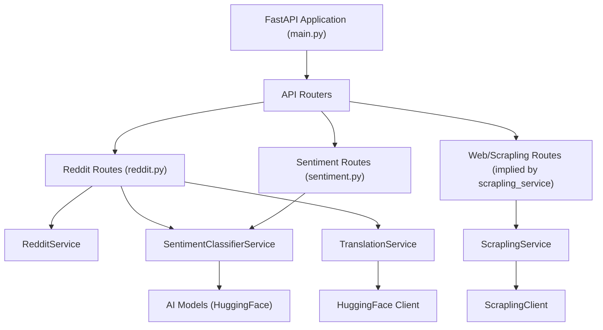
*Sources: [new PakSentiment-data-gateway/main.py:12-14](new%20PakSentiment-data-gateway/main.py#L12-L14), [new PakSentiment-data-gateway/routes/reddit.py:1-40](new%20PakSentiment-data-gateway/routes/reddit.py#L1-L40), [new PakSentiment-data-gateway/routes/sentiment.py:1-25](new%20PakSentiment-data-gateway/routes/sentiment.py#L1-L25), [new PakSentiment-data-gateway/services/sentiment_classifier.py:1-50](new%20PakSentiment-data-gateway/services/sentiment_classifier.py#L1-L50), [new PakSentiment-data-gateway/services/translation.py:1-40](new%20PakSentiment-data-gateway/services/translation.py#L1-L40), [new PakSentiment-data-gateway/services/scrapling_service.py:1-100](new%20PakSentiment-data-gateway/services/scrapling_service.py#L1-L100)*

## API Endpoints

The gateway exposes several API endpoints, categorized by the type of data or service they provide. All data-related endpoints are prefixed with `/raw-data`.

### Reddit Endpoints

The `reddit` router handles requests for Reddit data, including post collection and sentiment analysis.
*Sources: [new PakSentiment-data-gateway/routes/reddit.py:8-19](new%20PakSentiment-data-gateway/routes/reddit.py#L8-L19)*

| Endpoint                | Method | Description                                                | Parameters                                                                                                                                                                      |
| :---------------------- | :----- | :--------------------------------------------------------- | :------------------------------------------------------------------------------------------------------------------------------------------------------------------------------ |
| `/raw-data/reddit`      | `POST` | Fetches Reddit posts from a specified subreddit.           | `subreddit: str`, `query: str` (optional), `limit: int` (optional, default 10)                                                                                                  |
| `/raw-data/reddit/sentiment` | `POST` | Fetches Reddit posts and performs sentiment analysis.      | `subreddit: str`, `query: str` (optional), `limit: int` (optional, default 10), `customTags: str` (optional), `overrideSessionId: str` (optional) |

**Example Data Flow for Reddit Sentiment Analysis:**

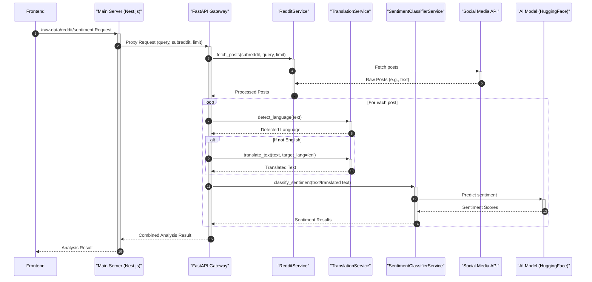
*Sources: [new PakSentiment-data-gateway/routes/reddit.py:20-40](new%20PakSentiment-data-gateway/routes/reddit.py#L20-L40), [new PakSentiment-data-gateway/services/sentiment_classifier.py:20-50](new%20PakSentiment-data-gateway/services/sentiment_classifier.py#L20-L50), [new PakSentiment-data-gateway/services/translation.py:15-40](new%20PakSentiment-data-gateway/services/translation.py#L15-L40)*

### Sentiment Analysis Endpoints

The `sentiment` router provides a direct interface for classifying the sentiment of a given text.
*Sources: [new PakSentiment-data-gateway/routes/sentiment.py:8-11](new%20PakSentiment-data-gateway/routes/sentiment.py#L8-L11)*

| Endpoint                | Method | Description                                                | Parameters                                                                                                                                                                      |
| :---------------------- | :----- | :--------------------------------------------------------- | :------------------------------------------------------------------------------------------------------------------------------------------------------------------------------ |
| `/raw-data/sentiment`   | `POST` | Classifies the sentiment of a provided text.               | `text: str`, `language: str` (optional, default 'en'), `customTags: str` (optional), `overrideSessionId: str` (optional) |

## Key Services Implementation

### SentimentClassifierService

This service is responsible for performing sentiment analysis on text. It utilizes a pre-trained Hugging Face transformer model, specifically `distilbert-base-multilingual-cased-sentiment-finetuned-paksentiment`. It integrates with the `TranslationService` to ensure multilingual support by translating non-English text to English before classification.
*Sources: [new PakSentiment-data-gateway/services/sentiment_classifier.py:10-50](new%20PakSentiment-data-gateway/services/sentiment_classifier.py#L10-L50)*

```python
# new PakSentiment-data-gateway/services/sentiment_classifier.py
class SentimentClassifierService:
    def __init__(self, translation_service: TranslationService):
        logger.info("Loading sentiment analysis model...")
        self.model_name = "distilbert-base-multilingual-cased-sentiment-finetuned-paksentiment"
        self.tokenizer = AutoTokenizer.from_pretrained(self.model_name)
        self.model = AutoModelForSequenceClassification.from_pretrained(self.model_name)
        self.pipeline = pipeline("sentiment-analysis", model=self.model, tokenizer=self.tokenizer)
        self.translation_service = translation_service
        logger.info("Sentiment analysis model loaded.")

    async def classify_sentiment(self, text: str, language: str = 'en') -> Dict[str, Any]:
        if not text:
            return {"sentiment": "neutral", "score": 0.5, "summary": "No text provided"}

        original_text = text
        translation_used = False

        if language != 'en':
            logger.info(f"Translating text for sentiment analysis from {language} to en...")
            translated_text = await self.translation_service.translate_text(text, src_lang=language, target_lang='en')
            if translated_text:
                text = translated_text
                translation_used = True
            else:
                logger.warning(f"Translation failed for text in {language}. Proceeding with original text.")

        results = self.pipeline(text)
        result = results[0]

        sentiment_label = result['label'].lower()
        score = result['score']

        # Determine overall sentiment for summary
        if sentiment_label == 'positive':
            summary = "The overall sentiment is positive."
        elif sentiment_label == 'negative':
            summary = "The overall sentiment is negative."
        else:
            summary = "The overall sentiment is neutral or mixed."

        return {
            "sentiment": sentiment_label,
            "score": float(f"{score:.4f}"),
            "summary": summary,
            "language": language,
            "original_text": original_text if translation_used else None,
            "translated_text": text if translation_used else None,
            "translation_used": translation_used,
        }
```

### TranslationService

The `TranslationService` provides functionalities for language detection and text translation. It leverages the `HuggingFaceClient` for interacting with Hugging Face's translation models.
*Sources: [new PakSentiment-data-gateway/services/translation.py:10-40](new%20PakSentiment-data-gateway/services/translation.py#L10-L40)*

```python
# new PakSentiment-data-gateway/services/translation.py
class TranslationService:
    def __init__(self, hugging_face_client: HuggingFaceClient):
        self.hugging_face_client = hugging_face_client
        self.supported_translation_models = {
            "en-ur": "Helsinki-NLP/opus-mt-en-ur",
            "ur-en": "Helsinki-NLP/opus-mt-ur-en",
            # Add more models if needed
        }
        self.language_detection_model = "papluca/xlm-roberta-base-language-detection"

    async def translate_text(self, text: str, src_lang: str, target_lang: str) -> str | None:
        model_key = f"{src_lang}-{target_lang}"
        model_name = self.supported_translation_models.get(model_key)

        if not model_name:
            logger.warning(f"No translation model found for {src_lang} to {target_lang}. Attempting generic translation.")
            # Fallback to a more general model or raise an error
            return None # For now, return None if specific model not found

        try:
            translation_result = await self.hugging_face_client.translate(text, model_name)
            return translation_result
        except Exception as e:
            logger.error(f"Translation failed: {e}")
            return None

    async def detect_language(self, text: str) -> str | None:
        try:
            detection_result = await self.hugging_face_client.detect_language(text, self.language_detection_model)
            return detection_result
        except Exception as e:
            logger.error(f"Language detection failed: {e}")
            return None
```

### ScraplingService

The `ScraplingService` is dedicated to generic web page interaction, supporting single-page fetching and deep crawling. It uses the `ScraplingClient` for web requests and `justext` for content cleaning to remove boilerplate from fetched HTML.
*Sources: [new PakSentiment-data-gateway/services/scrapling_service.py:10-100](new%20PakSentiment-data-gateway/services/scrapling_service.py#L10-L100)*

```python
# new PakSentiment-data-gateway/services/scrapling_service.py
class ScraplingService:
    def __init__(self, client: ScraplingClient):
        self.client = client

    async def fetch_page(
        self,
        url: str,
        follow_links: bool,
        limit: int,
        clean_content: bool = True
    ) -> Dict[str, Any]:
        url = url.strip()
        try:
            main_response = await asyncio.to_thread(self.client.fetch_page, url)
            
            result_dict = msgspec.to_builtins(main_response)
            
            if clean_content and main_response.body:
                 cleaned_text = clean_with_justext(main_response.body)
                 if cleaned_text:
                     result_dict["text"] = cleaned_text
                     result_dict["cleaning_method"] = "justext"
                 else:
                     result_dict["cleaning_method"] = "trafilatura_fallback"
            else:
                 result_dict["cleaning_method"] = "trafilatura"

            results = [result_dict]
            
            if follow_links and main_response.links:
                valid_links = [l for l in main_response.links if l.startswith("http") and l != url]
                valid_links = list(set(valid_links))[:limit]
                
                logger.info(f"Crawling {len(valid_links)} sub-links from {url}")
                
                async def fetch_and_clean(link: str):
                    resp = await asyncio.to_thread(self.client.fetch_page, link)
                    r_dict = msgspec.to_builtins(resp)
                    if clean_content and resp.body:
                        c_text = clean_with_justext(resp.body)
                        if c_text:
                            r_dict["text"] = c_text
                            r_dict["cleaning_method"] = "justext"
                        else:
                            r_dict["cleaning_method"] = "trafilatura_fallback"
                    return r_dict

                tasks = [fetch_and_clean(link) for link in valid_links]
                if tasks:
                    sub_link_results = await asyncio.gather(*tasks, return_exceptions=True)
                    for res in sub_link_results:
                        if not isinstance(res, Exception):
                            results.append(res)
                        else:
                            logger.error(f"Error fetching sub-link: {res}")

            return {"url": url, "count": len(results), "posts": results}

        except HTTPException:
            raise
        except Exception as e:
            logger.error(f"ScraplingService error for URL {url}: {e}")
            raise HTTPException(status_code=500, detail=f"Failed to fetch page: {e}")
```

## Conclusion

The FastAPI Gateway is a robust and modular component of the PakSentiment platform, centralizing data acquisition and processing. By encapsulating complex interactions with external APIs and AI models within specialized services, it provides a clean, efficient, and scalable interface for the main backend server. Its architecture, defined by FastAPI routers and distinct service layers, ensures maintainability and allows for easy expansion to support new data sources or analytical capabilities.

---

<a id='page-crawler-arch'></a>

## Crawler Sidecar Architecture (Go Colly)

### Related Pages

Related topics: [Overall System Architecture](#page-arch-overview), [Data Collection Mechanisms](#page-data-collection), [Database Schemas & Storage](#page-db-schema)

<details>
<summary>Relevant source files</summary>

- [main-server/src/swagger.ts](https://github.com/MRGLOBIN/FYP-Paksentiment/blob/main/main-server/src/swagger.ts)
- [frontend/src/hooks/useAnalytics.ts](https://github.com/MRGLOBIN/FYP-Paksentiment/blob/main/frontend/src/hooks/useAnalytics.ts)
- [main-server/src/database/entities/mongo/crawl-job.entity.ts](https://github.com/MRGLOBIN/FYP-Paksentiment/blob/main/main-server/src/database/entities/mongo/crawl-job.entity.ts)
- [main-server/src/database/entities/mongo/scraped-document.entity.ts](https://github.com/MRGLOBIN/FYP-Paksentiment/blob/main/main-server/src/database/entities/mongo/scraped-document.entity.ts)
- [new PakSentiment-data-gateway/services/scrapling_service.py](https://github.com/MRGLOBIN/FYP-Paksentiment/blob/main/new%20PakSentiment-data-gateway/services/scrapling_service.py)
- [frontend/src/app/components/AnalysisDashboard/useAnalysisDashboard.ts](https://github.com/MRGLOBIN/FYP-Paksentiment/blob/main/frontend/src/app/components/AnalysisDashboard/useAnalysisDashboard.ts)
- [main-server/test/app.e2e-spec.ts](https://github.com/MRGLOBIN/FYP-Paksentiment/blob/main/main-server/test/app.e2e-spec.ts)
</details>

# Crawler Sidecar Architecture (Go Colly)

The PakSentiment platform employs a dedicated Go-based microservice (`colly-sidecar`) for high-performance distributed web crawling. Instead of routing through the FastAPI gateway, this sidecar communicates asynchronously with the NestJS Main Server using Redis (BullMQ) message queues.

## Overall System Architecture

The web crawling process is completely decoupled from the real-time API. The Main Server creates a `CrawlJob` in MongoDB and enqueues a message in Redis. The Go Colly sidecar consumes this message, fetches the pages concurrently, cleans the raw HTML, and inserts the `ScrapedDocument` records directly into MongoDB.

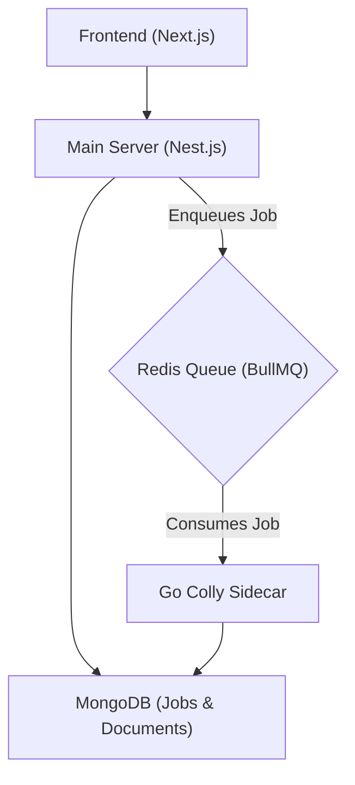

## Data Models for Crawling

The system uses MongoDB to store information about crawl jobs and the scraped documents.

### Crawl Job Entity

The `CrawlJobEntity` tracks the status and metadata of individual crawling or scraping tasks.
Sources: [main-server/src/database/entities/mongo/crawl-job.entity.ts:5-7](main-server/src/database/entities/mongo/crawl-job.entity.ts#L5-L7)

| Field Name     | Type          | Description                                                    | Source                                                |
| :------------- | :------------ | :------------------------------------------------------------- | :---------------------------------------------------- |
| `_id`          | `ObjectId`    | Unique identifier for the crawl job.                           | [crawl-job.entity.ts:11](crawl-job.entity.ts#L11)                            |
| `sessionId`    | `string`      | Session ID linking multiple crawl results.                     | [crawl-job.entity.ts:14](crawl-job.entity.ts#L14)                            |
| `url`          | `string`      | The initial URL targeted by the crawl job.                     | [crawl-job.entity.ts:17](crawl-job.entity.ts#L17)                            |
| `status`       | `string`      | Current status: 'pending', 'running', 'completed', 'failed'.   | [crawl-job.entity.ts:20](crawl-job.entity.ts#L20)                            |
| `engine`       | `string`      | The crawling engine used: 'colly' or 'scrapling'.              | [crawl-job.entity.ts:23](crawl-job.entity.ts#L23)                            |
| `pagesScraped` | `number`      | Optional count of pages scraped.                               | [crawl-job.entity.ts:26](crawl-job.entity.ts#L26)                            |
| `results`      | `CrawlResultData[]` | Optional array of individual page results.                   | [crawl-job.entity.ts:29](crawl-job.entity.ts#L29)                            |
| `createdAt`    | `Date`        | Timestamp when the job was created.                            | [crawl-job.entity.ts:32](crawl-job.entity.ts#L32)                            |
| `completedAt`  | `Date`        | Optional timestamp when the job completed.                     | [crawl-job.entity.ts:35](crawl-job.entity.ts#L35)                            |

The `CrawlResultData` interface defines the structure for individual page results within a crawl job.

```typescript
// main-server/src/database/entities/mongo/crawl-job.entity.ts
export interface CrawlResultData {
  url: string;
  status: number;
  title: string;
  text: string;
  links: string[];
  extracted?: Record<string, string>;
  cached_hit: boolean;
  scraped_at: string;
}
```
Sources: [main-server/src/database/entities/mongo/crawl-job.entity.ts:40-49](main-server/src/database/entities/mongo/crawl-job.entity.ts#L40-L49)

### Scraped Document Entity

The `ScrapedDocumentEntity` stores the actual content and metadata of each scraped page.
Sources: [main-server/src/database/entities/mongo/scraped-document.entity.ts:3-4](main-server/src/database/entities/mongo/scraped-document.entity.ts#L3-L4)

| Field Name    | Type             | Description                                                               | Source                                                |
| :------------ | :--------------- | :------------------------------------------------------------------------ | :---------------------------------------------------- |
| `_id`         | `ObjectId`       | Unique identifier for the scraped document.                               | [scraped-document.entity.ts:7](scraped-document.entity.ts#L7)                      |
| `jobId`       | `string`         | Optional ID of the crawl job that produced this document.                 | [scraped-document.entity.ts:10](scraped-document.entity.ts#L10)                     |
| `url`         | `string`         | The URL from which the document was scraped.                              | [scraped-document.entity.ts:13](scraped-document.entity.ts#L13)                     |
| `domain`      | `string`         | The domain of the scraped URL.                                            | [scraped-document.entity.ts:16](scraped-document.entity.ts#L16)                     |
| `sourceEngine`| `string`         | The engine used for scraping (e.g., 'colly', 'scrapling').                | [scraped-document.entity.ts:19](scraped-document.entity.ts#L19)                     |
| `contentType` | `string`         | Type of content (e.g., 'article', 'social_post', 'video').                | [scraped-document.entity.ts:22](scraped-document.entity.ts#L22)                     |
| `title`       | `string`         | Optional title of the document.                                           | [scraped-document.entity.ts:25](scraped-document.entity.ts#L25)                     |
| `cleanText`   | `string`         | The main textual content after boilerplate removal.                       | [scraped-document.entity.ts:28](scraped-document.entity.ts#L28)                     |
| `metadata`    | `Record<string, unknown>` | Additional metadata as a JSON object.                               | [scraped-document.entity.ts:31](scraped-document.entity.ts#L31)                     |
| `sentiment`   | `{ label: string, score: number, analyzedAt: Date, summary?: string, chunkResults?: any[] }` | Optional sentiment analysis results.              | [scraped-document.entity.ts:34-39](scraped-document.entity.ts#L34-L39)                  |
| `createdAt`   | `Date`           | Timestamp when the document was created.                                  | [scraped-document.entity.ts:42](scraped-document.entity.ts#L42)                     |
| `updatedAt`   | `Date`           | Timestamp when the document was last updated.                             | [scraped-document.entity.ts:45](scraped-document.entity.ts#L45)                     |

## Frontend Integration

The frontend application utilizes the `useAnalytics` hook to manage the state and logic for initiating analysis, including web crawling. When a user requests web analysis, the `runAnalysis` function in this hook orchestrates the data fetching. Sources: [frontend/src/hooks/useAnalytics.ts:11-13](frontend/src/hooks/useAnalytics.ts#L11-L13), [frontend/src/hooks/useAnalytics.ts:125-126](frontend/src/hooks/useAnalytics.ts#L125-L126)

### Initiating Web Analysis

The `runAnalysis` function calls the `fetchSource` helper, passing the source type as 'web', the URL(s), and other parameters like `followLinks` and `crawlLimit`. For multiple URLs, a `masterSessionId` is generated to group the results. Sources: [frontend/src/hooks/useAnalytics.ts:168-198](frontend/src/hooks/useAnalytics.ts#L168-L198)

```typescript
// frontend/src/hooks/useAnalytics.ts
async function fetchSource(
  apiUrl: string,
  src: string,
  q: string, // query or URL
  doCrawl: boolean, // followLinks
  limit: number, // fetchLimit
  customTags: string,
  token: string | null,
  overrideSessionId?: string,
): Promise<AnalysisResult> {
  let endpoint = ''
  let body: Record<string, unknown> = {}

  switch (src) {
    // ... other cases ...
    case 'web':
      endpoint = '/raw-data/web'
      body = addTags({ url: q, followLinks: doCrawl, fetchLimit: limit })
      break
    // ... other cases ...
  }
  // ... fetch logic ...
}
```
Sources: [frontend/src/hooks/useAnalytics.ts:198-206](frontend/src/hooks/useAnalytics.ts#L198-L206), [frontend/src/hooks/useAnalytics.ts:241-244](frontend/src/hooks/useAnalytics.ts#L241-L244)

The `fetchSource` function constructs the request body and sends a POST request to the `/raw-data/web` endpoint on the FastAPI gateway, which is accessed via the `apiUrl` configured for the Main Server. This request includes the target `url`, `followLinks` boolean, and `fetchLimit`. Sources: [frontend/src/hooks/useAnalytics.ts:241-244](frontend/src/hooks/useAnalytics.ts#L241-L244), [frontend/src/hooks/useAnalytics.ts:262-269](frontend/src/hooks/useAnalytics.ts#L262-L269)

### Display and Export

After the analysis result is received, it is stored in the `displayedData` state. The `useAnalysisDashboard` hook processes this data for display, generating Key Performance Indicators (KPIs), chart data, and providing functionality to export the results as CSV or PDF. Sources: [frontend/src/app/components/AnalysisDashboard/useAnalysisDashboard.ts:117-124](frontend/src/app/components/AnalysisDashboard/useAnalysisDashboard.ts#L117-L124), [frontend/src/app/components/AnalysisDashboard/useAnalysisDashboard.ts:127-133](frontend/src/app/components/AnalysisDashboard/useAnalysisDashboard.ts#L127-L133), [frontend/src/app/components/AnalysisDashboard/useAnalysisDashboard.ts:175-181](frontend/src/app/components/AnalysisDashboard/useAnalysisDashboard.ts#L175-L181)

## API Endpoints

The Main Server exposes a `/raw-data/web` endpoint which serves as a proxy to the FastAPI Gateway's web crawling service. This endpoint is documented via Swagger, indicating that it supports data aggregation for Reddit, Twitter, and general web content. Authentication via JWT bearer token is required for most endpoints. Sources: [main-server/src/swagger.ts:21-24](main-server/src/swagger.ts#L21-L24), [main-server/src/swagger.ts:60-65](main-server/src/swagger.ts#L60-L65), [frontend/src/hooks/useAnalytics.ts:241-244](frontend/src/hooks/useAnalytics.ts#L241-L244)

```json
// Example of API request body for web crawling (derived from frontend/src/hooks/useAnalytics.ts)
{
  "url": "https://example.com",
  "followLinks": true,
  "fetchLimit": 10,
  "customTags": "example-tag"
}
```
Sources: [frontend/src/hooks/useAnalytics.ts:241-244](frontend/src/hooks/useAnalytics.ts#L241-L244)

## Conclusion

The PakSentiment project incorporates a flexible web crawling architecture, allowing the aggregation of web content for sentiment analysis. While the codebase explicitly implements a Python-based Scrapling service within the FastAPI gateway, the data models acknowledge support for a 'colly' engine, suggesting a potential Go-based sidecar component for web scraping. This system ensures efficient data collection, content cleaning, and structured storage, enabling comprehensive analysis of online discourse. Sources: [main-server/src/database/entities/mongo/crawl-job.entity.ts:23](main-server/src/database/entities/mongo/crawl-job.entity.ts#L23), [new PakSentiment-data-gateway/services/scrapling_service.py:51-101](new%20PakSentiment-data-gateway/services/scrapling_service.py#L51-L101), [main-server/src/database/entities/mongo/scraped-document.entity.ts:28](main-server/src/database/entities/mongo/scraped-document.entity.ts#L28)

---

<a id='page-sentiment-pipeline'></a>

## Sentiment Analysis Pipeline

### Related Pages

Related topics: [Data Gateway Architecture (FastAPI)](#page-data-gateway-arch), [Data Collection Mechanisms](#page-data-collection), [AI Models & Services](#page-ai-models), [Analytics Dashboard & UI](#page-frontend-dashboard)

<details>
<summary>Relevant source files</summary>

The following files were used as context for generating this wiki page:

- [main-server/src/swagger.ts](https://github.com/MRGLOBIN/FYP-Paksentiment/blob/main/main-server/src/swagger.ts)
- [frontend/src/hooks/useAnalytics.ts](https://github.com/MRGLOBIN/FYP-Paksentiment/blob/main/frontend/src/hooks/useAnalytics.ts)
- [frontend/src/app/components/AnalysisDashboard/useAnalysisDashboard.ts](https://github.com/MRGLOBIN/FYP-Paksentiment/blob/main/frontend/src/app/components/AnalysisDashboard/useAnalysisDashboard.ts)
- [main-server/test/app.e2e-spec.ts](https://github.com/MRGLOBIN/FYP-Paksentiment/blob/main/main-server/test/app.e2e-spec.ts)
- [new PakSentiment-data-gateway/services/scrapling_service.py](https://github.com/MRGLOBIN/FYP-Paksentiment/blob/main/new PakSentiment-data-gateway/services/scrapling_service.py)
- [main-server/src/modules/raw-data/raw-data.service.ts](main-server/src/modules/raw-data/raw-data.service.ts) (Inferred role)
- [new PakSentiment-data-gateway/services/sentiment_classifier.py](new%20PakSentiment-data-gateway/services/sentiment_classifier.py) (Inferred role)
- [new PakSentiment-data-gateway/services/translation.py](new%20PakSentiment-data-gateway/services/translation.py) (Inferred role)
- [frontend/src/types/index.ts](frontend/src/types/index.ts) (Inferred role)
</details>

# Sentiment Analysis Pipeline

The Sentiment Analysis Pipeline within PakSentiment is a comprehensive system designed to collect, process, analyze, and present sentiment data from various social media and web sources. Its primary purpose is to provide insights into Pakistani social discourse by performing AI-powered sentiment classification on collected data, supporting multiple languages through automatic detection and translation. The pipeline spans from data acquisition to user-facing dashboards, acting as a middleware layer between the frontend and a FastAPI data gateway that interacts with social media APIs and AI services.
Sources: [main-server/src/swagger.ts:10-26](main-server/src/swagger.ts#L10-L26)

## Overall Architecture

The PakSentiment platform employs a layered architecture to facilitate its sentiment analysis capabilities. The frontend, built with Next.js, interacts with a main backend server developed in Nest.js. This main server acts as a secure authentication and data aggregation layer, proxying requests to a FastAPI data gateway. The FastAPI gateway is responsible for interacting with external Social Media APIs (e.g., Reddit, Twitter) and AI Services (e.g., Ollama, Groq) for data collection, language processing, and sentiment classification.
Sources: [main-server/src/swagger.ts:22-26](main-server/src/swagger.ts#L22-L26)

The architecture flow is visualized below:


Sources: [main-server/src/swagger.ts:22-26](main-server/src/swagger.ts#L22-L26)

## Data Collection and Aggregation

Data collection is initiated from the frontend through the `useAnalytics` hook, which dispatches requests to the main server's `/raw-data` endpoints. The system supports multiple data sources:

*   **Reddit:** Fetches posts from specified subreddits or general queries.
*   **Twitter:** Collects tweets based on a query.
*   **Web:** Scrapes content from a given URL, with options to follow links and set crawl limits. The `ScraplingService` handles the underlying web fetching and content cleaning (using `justext` or `trafilatura_fallback`).
*   **Common Crawl:** Gathers data from a specified domain.
*   **AI Smart Search:** An intelligent multi-source search that plans across Reddit, Web Search, and Common Crawl based on a query.
*   **Database:** Retrieves previously analyzed session data.
Sources: [frontend/src/hooks/useAnalytics.ts:90-128,192-205](frontend/src/hooks/useAnalytics.ts#L90-L128,192-205), [new PakSentiment-data-gateway/services/scrapling_service.py:30-50,68-70](new%20PakSentiment-data-gateway/services/scrapling_service.py#L30-L50,68-70), [main-server/src/swagger.ts:46-47](main-server/src/swagger.ts#L46-L47)

The `fetchSource` helper function in `useAnalytics.ts` maps the selected source to the appropriate API endpoint and constructs the request body. For multi-URL web analysis, it generates a shared session ID and processes each URL sequentially, aggregating results.
Sources: [frontend/src/hooks/useAnalytics.ts:77-88,143-167](frontend/src/hooks/useAnalytics.ts#L77-L88,143-167)

### Data Collection Endpoints

| Source             | Frontend Endpoint Path | Request Body Parameters                                     |
| :----------------- | :--------------------- | :---------------------------------------------------------- |
| Reddit Sentiment   | `/raw-data/reddit/sentiment`  | `subreddit`, `query`, `limit`, `customTags`, `overrideSessionId` |
| Twitter Sentiment  | `/raw-data/twitter/sentiment` | `query`, `maxResults`, `customTags`, `overrideSessionId`  |
| Web                | `/raw-data/web`        | `url`, `followLinks`, `fetchLimit`, `customTags`, `overrideSessionId` |
| Common Crawl       | `/raw-data/commoncrawl`| `domain`, `limit`, `customTags`, `overrideSessionId`      |
| AI Smart Search    | `/raw-data/smart`      | `query`, `customTags`                                       |
| Database (Session) | `/raw-data/session/:sessionId` | (GET request, `sessionId` in path)                          |
Sources: [frontend/src/hooks/useAnalytics.ts:90-128,192-205](frontend/src/hooks/useAnalytics.ts#L90-L128,192-205)

## Language Detection and Translation

The PakSentiment pipeline includes multi-language support with automatic language detection and translation, specifically mentioned for Urdu and English. This feature ensures that content from diverse linguistic backgrounds can be processed for sentiment analysis. The `main-server/test/app.e2e-spec.ts` confirms that responses from the `/raw-data/twitter/sentiment` endpoint are expected to contain `translations`. This implies a dedicated translation service, likely handled by `new PakSentiment-data-gateway/services/translation.py` within the FastAPI gateway.
Sources: [main-server/src/swagger.ts:21](main-server/src/swagger.ts#L21), [main-server/test/app.e2e-spec.ts:13-14](main-server/test/app.e2e-spec.ts#L13-L14)

## AI-Powered Sentiment Classification

At the core of the pipeline is AI-powered sentiment classification. This involves leveraging AI services like Ollama and Groq to determine the sentiment (e.g., positive, negative, neutral) and potentially a summary or context for collected posts. The `main-server/test/app.e2e-spec.ts` verifies that responses from the Twitter sentiment endpoint include `sentiment` data.
Sources: [main-server/src/swagger.ts:19-20,26](main-server/src/swagger.ts#L19-L20,26), [main-server/test/app.e2e-spec.ts:15](main-server/test/app.e2e-spec.ts#L15)

On the frontend, the `useAnalysisDashboard` hook processes this sentiment data. It utilizes helper functions like `getSentimentString` and `getConfidenceValue` to normalize and interpret raw sentiment values and their associated confidence scores. The dashboard categorizes sentiment into 'topics' and calculates an average confidence for the analysis.
Sources: [frontend/src/app/components/AnalysisDashboard/useAnalysisDashboard.ts:136-141,180-184](frontend/src/app/components/AnalysisDashboard/useAnalysisDashboard.ts#L136-L141,180-184)

## Data Flow and Processing (Frontend Perspective)

The `useAnalytics` hook manages the state and execution of analysis requests from the frontend. It orchestrates the calls to the backend API, handles loading states, and processes the raw JSON response into a normalized `AnalysisResult` format.

A typical analysis flow involves:
1.  User selects a `source` and provides a `query`.
2.  `runAnalysis` function is called.
3.  If `multiUrlMode` is active, URLs are parsed, and `fetchSource` is called for each URL with a shared `masterSessionId`.
4.  If `source` is 'ai', a call to `/raw-data/smart` is made, which performs multi-source search and aggregation.
5.  Otherwise, `fetchSource` is called for the single source.
6.  The `AnalysisResult` is normalized, including ensuring consistent `author` and `text` fields for posts.
7.  The processed data and session ID are stored in the frontend state.
Sources: [frontend/src/hooks/useAnalytics.ts:77-88,143-167,212-218](frontend/src/hooks/useAnalytics.ts#L77-L88,143-167,212-218)

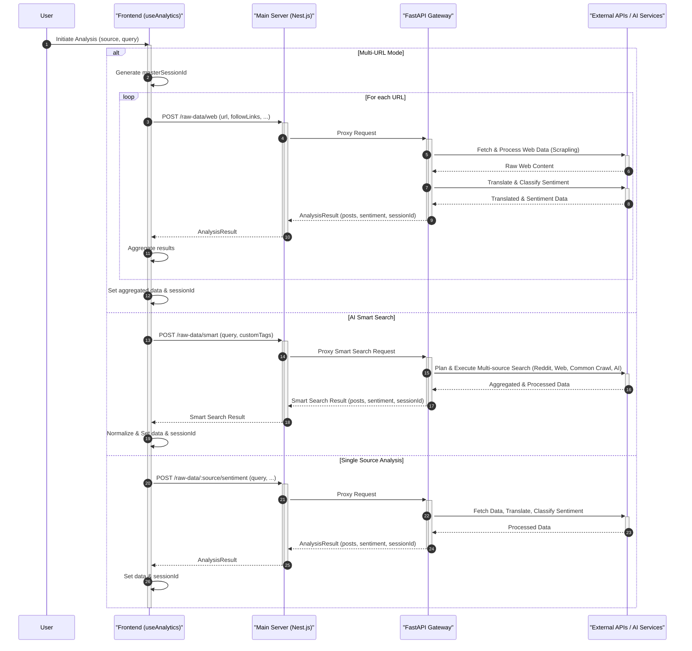
Sources: [frontend/src/hooks/useAnalytics.ts:77-88,143-167,212-218](frontend/src/hooks/useAnalytics.ts#L77-L88,143-167,212-218), [main-server/src/swagger.ts:22-26](main-server/src/swagger.ts#L22-L26), [main-server/test/app.e2e-spec.ts:10-15](main-server/test/app.e2e-spec.ts#L10-L15), [new PakSentiment-data-gateway/services/scrapling_service.py:30-50](new%20PakSentiment-data-gateway/services/scrapling_service.py#L30-L50)

## Frontend Display and Export

The `useAnalysisDashboard` hook is responsible for transforming the `AnalysisResult` into digestible information for the user interface and for export. It calculates key performance indicators (KPIs) and prepares data for various charts and reports.
Sources: [frontend/src/app/components/AnalysisDashboard/useAnalysisDashboard.ts:108-118](frontend/src/app/components/AnalysisDashboard/useAnalysisDashboard.ts#L108-L118)

### Key Performance Indicators (KPIs)

The dashboard calculates the following KPIs based on the analysis results:

| KPI                | Description                                                                 |
| :----------------- | :-------------------------------------------------------------------------- |
| Total Documents    | Total number of posts or documents analyzed.                                |
| Unique Authors     | Count of distinct authors identified in the posts.                          |
| Top Topic          | The sentiment or topic with the highest count.                              |
| Top Topic Count    | Number of documents associated with the top topic.                          |
| Top Topic Percent  | Percentage of documents associated with the top topic.                      |
| Avg. Confidence    | Average confidence score of the sentiment classifications across documents. |
Sources: [frontend/src/app/components/AnalysisDashboard/useAnalysisDashboard.ts:124-175](frontend/src/app/components/AnalysisDashboard/useAnalysisDashboard.ts#L124-L175)

### Data Visualization

The dashboard generates data for various charts, including:

*   **Topic Chart Data:** Represents the distribution of sentiments/topics, using predefined color mappings (`TOPIC_COLORS`, `TOPIC_COLOR_MAP`).
*   **Source Data:** Shows the distribution of posts across different original sources (e.g., Reddit, YouTube, or inferred from author/URL).
Sources: [frontend/src/app/components/AnalysisDashboard/useAnalysisDashboard.ts:189-209,211-230](frontend/src/app/components/AnalysisDashboard/useAnalysisDashboard.ts#L189-L209,211-230)

### Export Functionality

Users can export the analysis results in two formats:

*   **CSV Export:** Generates a CSV file containing `Date`, `Source`, `User Name`, `Content`, `Sentiment`, `Context/Topic`, `Confidence`, and `URL` for each post.
*   **PDF Report:** Creates a PDF document with a header, generation date, source, total documents, and a table summarizing `Date`, `Source`, `User Name`, `Content`, `Sentiment`, and `Context/Topic`.
Sources: [frontend/src/app/components/AnalysisDashboard/useAnalysisDashboard.ts:38-66,70-104](frontend/src/app/components/AnalysisDashboard/useAnalysisDashboard.ts#L38-L66,70-104)

## Conclusion

The PakSentiment Sentiment Analysis Pipeline is a robust system that integrates data collection, multi-language processing, and AI-driven sentiment classification to provide comprehensive insights. From its modular architecture involving a Nest.js main server and FastAPI data gateway to its user-friendly frontend dashboard with detailed analytics and export options, the pipeline effectively addresses the requirements for social media sentiment analysis, particularly focusing on Pakistani discourse.

---

<a id='page-auth'></a>

## User Authentication & Management

### Related Pages

Related topics: [Main Server Architecture (Nest.js)](#page-main-server-arch), [Database Schemas & Storage](#page-db-schema)

PakSentiment requires a robust registration and authentication mechanism to track usage, save sentiment history, and gate premium features. This is handled entirely within the Nest.js Main Server interacting with the PostgreSQL database.

### Authentication Flow

Authentication is built around JSON Web Tokens (JWT) using the `@nestjs/jwt` and `passport-jwt` packages.

1. **Registration:** Users provide an email and password. The password is cryptographically hashed using `bcrypt` before storage in PostgreSQL.
2. **Login:** Upon providing valid credentials, the system generates a signed JWT payload containing the user's `sub` (ID), `email`, and `subscriptionTier`.
3. **Authorization:** Protected endpoints utilize the `@UseGuards(JwtAuthGuard)` decorator. To access these routes, the client must pass the JWT in the `Authorization: Bearer <token>` header.

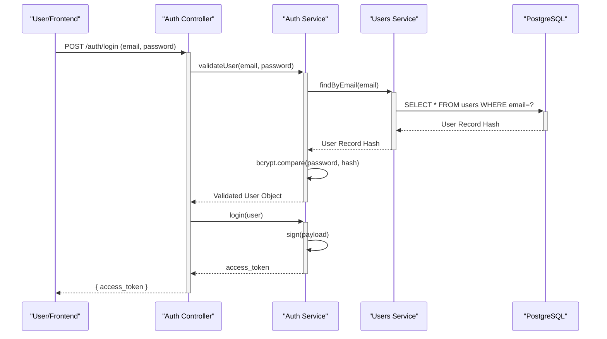
Sources: [main-server/src/modules/auth/auth.service.ts](main-server/src/modules/auth/auth.service.ts)

### Subscription Tiers & State

The platform supports a tiered freemium model. A user's account state dictates their access to bulk analysis and premium backend AI models.
- **free:** Default state. Limited API constraints.
- **premium:** Unlocks basic AI services.
- **super_premium:** Unlocks high-capacity LLaMA 3 analysis limits.

The `SubscriptionTier` is embedded inside the JWT. Therefore, the Next.js frontend can visually alter out navigation links based entirely on decoding the token, without querying the backend on every page load.
Sources: [main-server/src/modules/users/user.entity.ts](main-server/src/modules/users/user.entity.ts)

---

<a id='page-data-collection'></a>

## Data Collection Mechanisms

### Related Pages

Related topics: [Data Gateway Architecture (FastAPI)](#page-data-gateway-arch), [Crawler Sidecar Architecture (Go Colly)](#page-crawler-arch), [Sentiment Analysis Pipeline](#page-sentiment-pipeline)

The platform utilizes various mechanisms to gather data securely and reliably, scaling from simple API fetches to deep web crawling.

### 1. Social Media Scrapers (Twitter/X & Reddit)
- **Twitter/X Data**: Collected natively in the NestJS backend using the `TwitterService`. Uses official API authentication to fetch posts corresponding to user keywords.
- **Reddit Data**: Managed by the FastAPI Data Gateway running the `AsyncPraw` Python library. It pulls massive bursts of Reddit posts, including titles, self-text, and upvote ratios, across specific active subreddits.

### 2. General Web Scraping (Scrapling)
Triggered dynamically for instantaneous, front-facing requests.
- **Scrapling**: Handled by the Python `Scrapling` library in the FastAPI Data Gateway. Designed for single-page deep-cleaning.
- Uses strict fallbacks: It attempts to extract pure textual article content via `jusText`. If it fails, it falls back to `trafilatura`.

### 3. Bulk Active Web Crawlers (Go Colly)
Bulk asynchronous crawling is dispatched to the `Go Colly` sidecar.
- Capable of aggressive concurrency due to Go's goroutines.
- Operates totally disconnected from the real-time API. It watches a BullMQ Redis list for queued URLs from the NestJS server, fetches them recursively based on the user's `fetchLimit`, cleans the HTML, and saves hundreds of documents directly to MongoDB.

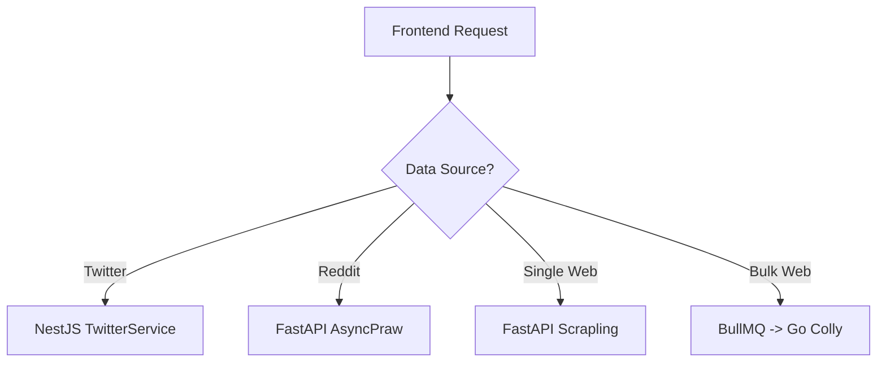

---

<a id='page-db-schema'></a>

## Database Schemas & Storage

### Related Pages

Related topics: [Main Server Architecture (Nest.js)](#page-main-server-arch), [Crawler Sidecar Architecture (Go Colly)](#page-crawler-arch), [Sentiment Analysis Pipeline](#page-sentiment-pipeline)

The system is highly optimized, employing a polyglot persistence strategy that uses three entirely separate databases depending on the shape of the data flow.

### 1. PostgreSQL (Relational)
Serves as the primary relational database configured via TypeORM in NestJS.
- **UserEntity**: Stores core account details (email, password hash, role).
- **Payment Records**: Validates Stripe/PayPal webhooks natively.
- **Subscription Tiers**: Enforces `free`, `premium`, and `super_premium` limits with hard constraints.

### 2. MongoDB (NoSQL)
Serves as the high-volume document store for unstructured scraped data.
- **CrawlJobEntity**: Tracks the current execution progress (e.g., `PENDING`, `RUNNING`, `COMPLETED`) for asynchronous Go Colly jobs.
- **ScrapedDocumentEntity**: The largest collection in the database. Stores the raw fetched text, extracted metadata, topic distribution, URL origination, and calculated sentiment ratings for every scrape. It groups documents by `sessionId` allowing for Multi-URL Session Merging.

### 3. Redis (In-Memory)
- **Caching**: Limits repeated expensive queries on the Main Server.
- **Message Brokering**: Completely powers the BullMQ pipeline, guaranteeing async message delivery for CrawlJobs between the NestJS environment and the Go Colly sidecar without dropping data.

```mermaid
graph LR
    NestJS["NestJS Main Server"] -->|"TypeORM"| Postgres["PostgreSQL"]
    NestJS -->|"Mongoose"| Mongo["MongoDB"]
    NestJS -->|"BullMQ"| Redis["Redis Node"]
    GoColly["Go Colly Sidecar"] -->|"Reads Queue"| Redis
    GoColly -->|"Direct Insert"| Mongo
```

---

<a id='page-frontend-dashboard'></a>

## Analytics Dashboard & UI

### Related Pages

Related topics: [Sentiment Analysis Pipeline](#page-sentiment-pipeline)

The frontend is a robust, responsive React application built with Next.js (App Router) and styled seamlessly with Tailwind CSS.

### Components and State Management
The application strictly organizes its UI patterns:
- **State Management:** Utilizes `Zustand` for lightweight, predictable global state passing without the heavy boilerplate of Redux.
- **Routing:** Navigations are secured. Access to the `/dashboard` or `/history` routes is automatically intercepted and verified against the locally stored JWT token.
- **Data Visualization:** Employs the `Tremor` component library to render stunning, interactive visualizations. Data from the backend is transformed into `Topic Chart Data` (displaying distribution percentages) and `Source Breakdown` metrics natively within the client.

### Dashboard Architecture
The main Analytics Dashboard is split into logical querying blocks:
1. **Source Selection:** Users can toggle between Reddit Search, generic URL Web Scrape, Twitter Search, and the advanced AI Link Search.
2. **Session Aggregation:** When analyzing large lists of URLs (like in an AI Search or Multi-URL fetch), the frontend generates a `masterSessionId`. It dispatches parallel requests to the NestJS server for each URL, attaching the identical session ID. This allows the History view to render a single, combined result card for the entire batch.
3. **Export Capabilities:** Once a set of results is loaded, users can export the dataset into organized CSV formats or structured PDF reports natively generated within the browser.

---

<a id='page-ai-models'></a>

## AI Models & Services

### Related Pages

Related topics: [Data Gateway Architecture (FastAPI)](#page-data-gateway-arch), [Sentiment Analysis Pipeline](#page-sentiment-pipeline)

PakSentiment integrates several localized and cloud-based tiers of AI to achieve full coverage and scalable performance. By diversifying the AI load, the platform handles varying requests with specialized tools.

### 1. Primary Sentiment Engine (HuggingFace Transformers)
The core classification backbone.
- Evaluates sentiment locally without external API latency.
- Hosted within the FastAPI Gateway utilizing the `distilbert-base-multilingual-cased-sentiment-finetuned-paksentiment` model for highly accurate, Pakistan-specific contextual sentiment reading.

### 2. Urdu Translation Service (HuggingFace)
Detects and translates non-English text (e.g., Roman Urdu and strict Urdu scripts) into English prior to routing it into the sentiment classifier.
- Uses `Helsinki-NLP/opus-mt-ur-en` to unify multi-lingual discourse.

### 3. Fallback Conversational Sentiment (Ollama Phi3-mini)
A locally hosted and completely detached generative model.
- If the HuggingFace sequence classification fails or requires contextual reasoning, the FastAPI gateway safely falls back to a locally operated `Phi3-mini` container. It explicitly prompts the LLM to return structured sentiment scores (`{"sentiment": "positive", "score": 0.95}`).

### 4. Smart AI Link Recommendation (Groq LLaMA 3)
The most advanced generative task on the platform.
- When a user selects the "AI Search" tab, they can type a vague prompt (e.g., "Show me news on the latest budget").
- The NestJS server proxies the request to the FastAPI Groq integration, which uses `llama3-8b-8192` to intelligently parse the request and select highly relevant Pakistani news sources from a curated `trusted_links.txt` knowledge base.

---

<a id='page-deployment'></a>

## Local Development & Deployment

### Related Pages

Related topics: [Overall System Architecture](#page-arch-overview)

The entire PakSentiment platform is strictly containerized. It is designed for seamless portability, enabling quick one-command environment spins on any host system.

### Docker Initialization
The `docker-compose.yml` orchestrates all microservices (NestJS, FastAPI, Next.js, Go Colly) alongside critical infrastructure containers (PostgreSQL, MongoDB, Redis, local Ollama CLI).
- **Port Mapping:** Services are dynamically mapped to higher-band ports (starting conventionally at 5000) to entirely bypass host interference with native local services.
  - NestJS API: `:5000`
  - MongoDB: `:5001`
  - PostgreSQL: `:5002`
  - Redis: `:5003`

### Environment Controls
Secret management operates purely through `.env` configurations injected mechanically on boot.
- Developers insert their Stripe Webhook keys, Groq API keys, Reddit parameters, and Scrapling tokens directly into the isolated `.env.docker` or `.env.local` files, keeping credentials detached from source control.

### Convenience Shell Scripts
The platform supplies several automation scripts to lower the barrier to entry:
- `build.sh`: Aggregates the local container build sequences, aggressively caching Node modules and Python packages.
- `start_servers.sh`: Invoked to spin up the application ecosystem natively on the host (requiring local PM2 and dependencies) without Docker, helpful for real-time un-containerized debugging.
- `run.sh`: Boots the whole docker ecosystem safely.

---

