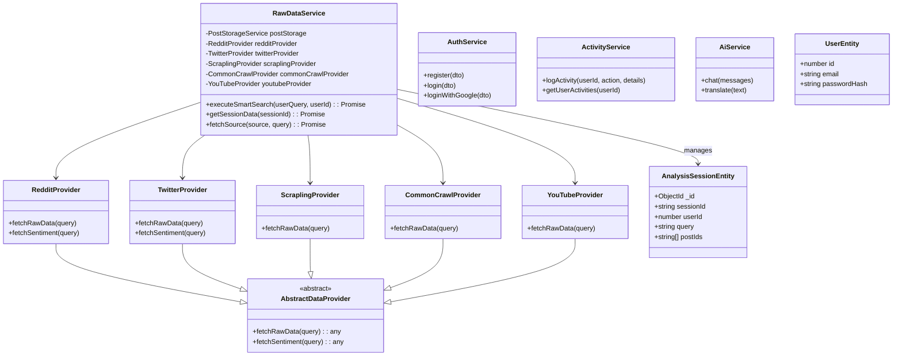
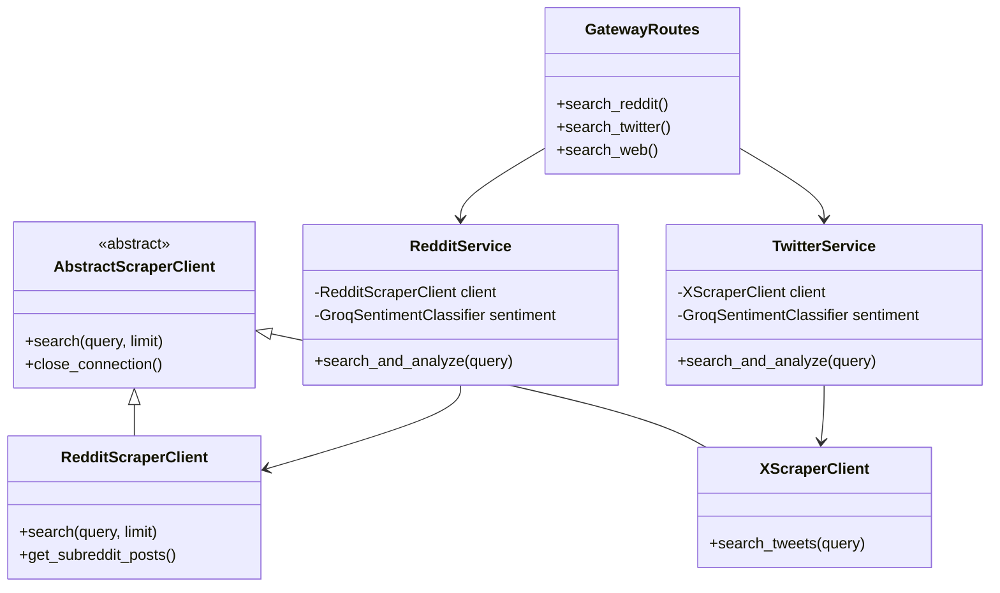

# PakSentiment - Complete Class Diagram

This document contains the comprehensive class diagram for the entire PakSentiment project, covering all four main components:

1. **main-server** (NestJS Backend)
2. **PakSentiment-data-gateway** (FastAPI Backend)
3. **PakSentiment-scraper** (Python Scraper Library)
4. **Frontend** (Next.js)

---

## System Architecture Overview

```mermaid
graph TB
    subgraph "Frontend (Next.js)"
        FE_Pages[Pages]
        FE_Store[Zustand Stores]
        FE_Hooks[Custom Hooks]
    end

    subgraph "Main Server (NestJS)"
        MS_Auth[AuthModule]
        MS_Activity[ActivityModule]
        MS_RawData[RawDataModule]
        MS_AI[AiModule]
    end

    subgraph "Data Gateway (FastAPI)"
        DG_Routes[API Routes]
        DG_Services[Domain Services]
        DG_Sentiment[SentimentClassifier]
    end

    subgraph "Scraper Library (Python)"
        SC_Base[AbstractScraperClient]
        SC_Reddit[RedditScraperClient]
        SC_Twitter[XScraperClient]
        SC_YouTube[YouTubeScraperClient]
        SC_CC[CommonCrawlScraperClient]
        SC_Scrapling[ScraplingClient]
    end

    subgraph "External APIs"
        Groq[Groq API / LLaMA]
        Google[Google OAuth]
        Reddit[Reddit API]
        Twitter[Twitter API]
        YouTube[YouTube API]
    end

    subgraph "Databases"
        Postgres[(PostgreSQL)]
        MongoDB[(MongoDB)]
    end

    FE_Pages --> FE_Store
    FE_Pages --> FE_Hooks
    FE_Hooks --> MS_Auth
    FE_Hooks --> MS_RawData
    FE_Hooks --> MS_AI

    MS_Auth --> Postgres
    MS_Activity --> Postgres
    MS_RawData --> DG_Routes
    MS_RawData --> MongoDB
    MS_AI --> Groq

    DG_Routes --> DG_Services
    DG_Services --> SC_Base
    DG_Services --> DG_Sentiment

    SC_Base <|-- SC_Reddit
    SC_Base <|-- SC_Twitter
    SC_Base <|-- SC_YouTube
    SC_Base <|-- SC_CC
    SC_Base <|-- SC_Scrapling

    SC_Reddit --> Reddit
    SC_Twitter --> Twitter
    SC_YouTube --> YouTube

    MS_Auth --> Google
```

---

## Main Server (NestJS) - Class Diagram



---

## Data Gateway (FastAPI) - Class Diagram



---

## Frontend (Next.js) - Data Flow Diagram

This diagram illustrates how data flows through the frontend application, from user interactions to API calls and state updates.

```mermaid
flowchart TB
    subgraph User["👤 User"]
        UserAction[User Action]
    end

    subgraph Pages["📄 Pages"]
        LoginPage["/login"]
        RegisterPage["/register"]
        DashboardPage["/dashboard"]
        AnalyticsPage["/analytics"]
        ChatPage["/chat"]
        TranslatePage["/translate"]
    end

    subgraph Hooks["🪝 Custom Hooks"]
        useAnalytics["useAnalytics()"]
        useActivities["useActivities()"]
    end

    subgraph Store["🗄️ Zustand Store"]
        useAuthStore["useAuthStore"]
        AuthState["{ user, token, isAuthenticated }"]
    end

    subgraph LocalStorage["💾 Browser Storage"]
        LS["localStorage (auth-storage)"]
    end

    subgraph Components["🧩 Components"]
        Navbar["Navbar"]
        AnalysisDashboard["AnalysisDashboard"]
        LoadingAnimation["LoadingAnimation"]
    end

    subgraph Backend["🖥️ Main Server API"]
        AuthAPI["/auth/*"]
        ActivityAPI["/activity/*"]
        RawDataAPI["/raw-data/*"]
        AIAPI["/ai/*"]
    end

    %% ===== Authentication Flow =====
    UserAction -->|"Login/Register"| LoginPage
    LoginPage -->|"credentials"| AuthAPI
    AuthAPI -->|"{ token, user }"| useAuthStore
    useAuthStore -->|"persist"| LS
    LS -->|"hydrate on load"| useAuthStore
    useAuthStore --> AuthState

    %% ===== Dashboard Flow =====
    UserAction -->|"View Dashboard"| DashboardPage
    DashboardPage --> useActivities
    useActivities -->|"GET /activity/me"| ActivityAPI
    ActivityAPI -->|"Activity[]"| useActivities
    useActivities -->|"render"| DashboardPage

    %% ===== Analytics Flow =====
    UserAction -->|"Run Analysis"| AnalyticsPage
    AnalyticsPage --> useAnalytics
    useAnalytics -->|"POST /smart or /source"| RawDataAPI
    RawDataAPI -->|"{ posts, sentiment }"| useAnalytics
    useAnalytics -->|"data"| AnalysisDashboard
    AnalysisDashboard -->|"Charts + Table"| AnalyticsPage

    %% ===== Chat/Translate Flow =====
    UserAction -->|"Send Message"| ChatPage
    ChatPage -->|"POST /ai/chat"| AIAPI
    AIAPI -->|"AI Response"| ChatPage

    UserAction -->|"Translate Text"| TranslatePage
    TranslatePage -->|"POST /ai/translate"| AIAPI
    AIAPI -->|"Translation"| TranslatePage

    %% ===== Shared Components =====
    useAuthStore --> Navbar
    Navbar -->|"Logout"| useAuthStore
```



### Data Flow Summary

| Flow | Trigger | Data Source | State Manager | UI Update |
|------|---------|-------------|---------------|-----------|
| **Login** | User submits form | `/auth/login` API | `useAuthStore` | Redirect to Dashboard |
| **Dashboard** | Page load | `/activity/me` API | `useActivities` hook | Render activity list |
| **Analytics** | User clicks "Analyze" | `/raw-data/smart` API | `useAnalytics` hook | Render charts & table |
| **Chat** | User sends message | `/ai/chat` API | Local `useState` | Append AI response |
| **Translate** | User clicks "Translate" | `/ai/translate` API | Local `useState` | Show translated text |

### State Persistence

- **Zustand Persist Middleware**: The `useAuthStore` uses `persist` to save `{ user, token, isAuthenticated }` to `localStorage` under the key `auth-storage`.
- **Hydration**: On page load, the store automatically rehydrates from `localStorage`, ensuring the user stays logged in across browser sessions.
