# PakSentiment Scraper Library - Class Diagram

This diagram details the architecture of the **PakSentiment-scraper** Python library. It highlights the Object-Oriented Design (OOP) principles used, including inheritance from a common abstract base class to ensure consistent lifecycle management (e.g., `close_connection`).

## Class Diagram

```mermaid
classDiagram
    direction TB

    %% ==================== ABSTRACT BASE ====================
    class AbstractScraperClient {
        <<abstract>>
        +__init__(*args, **kwargs)
        +close_connection()*
        +validate_config(config: Dict) bool
    }

    %% ==================== CONCRETE CLIENTS ====================
    class RedditScraperClient {
        -Reddit reddit
        +__init__(client_id, client_secret, user_agent)
        +fetch_submissions(subreddit_name, query, limit) List~Dict~
        +fetch_comments_for_submission(permalink) List~Dict~
        +close_connection()
    }

    class XScraperClient {
        -Client client
        +__init__(bearer_token, consumer_key, consumer_secret, ...)
        +search_tweets(query, max_results) List~Dict~
        +get_user_tweets(user_id, max_results) List~Dict~
        +close_connection()
    }

    class NitterScraperClient {
        -str nitter_instance
        -bool stealth
        +__init__(nitter_instance, stealth)
        +search(query, limit) List~Dict~
        +get_profile(username, limit) List~Dict~
        +close_connection()
    }

    class YouTubeScraperClient {
        -Resource youtube_service
        +__init__(api_key)
        +search_videos(query, max_results) List~YouTubeVideo~
        +get_video_comments(video_id, max_results) List~YouTubeComment~
        +get_video_transcript(video_id, languages) List~YouTubeTranscriptSnippet~
        +close_connection()
    }

    class CommonCrawlScraperClient {
        -str index_url
        -str data_url
        +__init__(index_url, data_url)
        +search(domain, limit, crawl_id) List~CommonCrawlRecord~
        +close_connection()
    }

    class ScraplingClient {
        -bool stealth
        +__init__(stealth, auto_match)
        +fetch(url, wait_selector) ScraplingResponse
        +fetch_many(urls) List~ScraplingResponse~
        +extract(url, selectors) ScraplingExtractedData
        +close_connection()
    }

    %% ==================== DATA MODELS (msgspec) ====================
    class YouTubeVideo {
        +str video_id
        +str title
        +str description
        +str channel_title
        +str published_at
    }

    class YouTubeComment {
        +str comment_id
        +str author
        +str text
        +int like_count
    }

    class CommonCrawlRecord {
        +str url
        +str text
        +str date
    }

    class ScraplingResponse {
        +int status
        +str text
        +str url
        +str body
    }

    %% ==================== RELATIONSHIPS ====================
    
    %% Inheritance
    AbstractScraperClient <|-- RedditScraperClient
    AbstractScraperClient <|-- XScraperClient
    AbstractScraperClient <|-- NitterScraperClient
    AbstractScraperClient <|-- YouTubeScraperClient
    AbstractScraperClient <|-- CommonCrawlScraperClient
    AbstractScraperClient <|-- ScraplingClient

    %% Dependencies / Returns
    YouTubeScraperClient ..> YouTubeVideo : returns
    YouTubeScraperClient ..> YouTubeComment : returns
    CommonCrawlScraperClient ..> CommonCrawlRecord : returns
    ScraplingClient ..> ScraplingResponse : returns
```

## Implementation Details

### Abstract Base Class (`base.py`)
- **`AbstractScraperClient`**: Enforces that all scrapers implementation the `close_connection` method. This is crucial for resource management (closing HTTP sessions, DB connections) in a long-running server environment.

### Clients
- **`RedditScraperClient`**: Wraps `asyncpraw` to provide async searching and comment fetching.
- **`XScraperClient`**: Wraps `tweepy.asynchronous.AsyncClient` for official Twitter API v2 access.
- **`NitterScraperClient`**: A custom scraper that parses HTML from Nitter instances (Twitter frontend) without API keys.
- **`YouTubeScraperClient`**: Uses `google-api-python-client` (wrapped in async executor or native async if available) and `youtube_transcript_api`.
- **`CommonCrawlScraperClient`**: Queries the Common Crawl Index Server and fetches the corresponding WET (Text) files.
- **`ScraplingClient`**: A general-purpose web scraper using `Playwright` or `cdp` (via the Scrapling abstraction) for dynamic sites.

### Data Models (`models.py`)
- The library uses `msgspec.Struct` for high-performance data modeling, offering faster serialization/deserialization than standard Python `dataclasses` or `pydantic`.
- **`YouTubeVideo`**, **`CommonCrawlRecord`**, etc., ensure type safety when passing data back to the Gateway.
