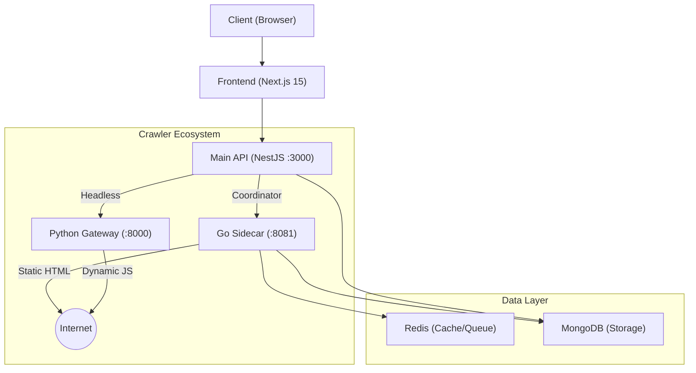

# System Architecture

## Overview

PakSentiment is a modern web scraping and sentiment analysis platform built on a distributed microservices architecture. It leverages specific technologies for their strengths: **Go** for high-performance crawling, **Python** for advanced content processing, and **NestJS/Next.js** for a robust application layer.

## Component Breakdown

### 1. Frontend (`/frontend`)
- **Framework**: Next.js 15 (App Router)
- **UI Library**: Material UI (MUI) v6
- **Visualization**: Recharts
- **State Management**: Zustand
- **Role**: Provides the dashboard for users to trigger crawls, view real-time stats, and analyze sentiment results.

### 2. Main Server (`/main-server`)
- **Framework**: NestJS (TypeScript)
- **Role**: Central orchestrator.
    - Handles JWT Authentication & Google OAuth.
    - Manages Crawl Jobs (dispatching to Go or Python services).
    - Serves REST API for the frontend.
    - Direct MongoDB access for job retrieval and user management.

### 3. Go Sidecar (`/colly-sidecar`)
- **Language**: Go (Golang) 1.23+
- **Core Library**: Colly (V2)
- **Key Feature**: **Readability Integration** (Mozilla's algorithm).
- **Role**: High-speed, concurrent crawling for static websites.
    - **Port**: 8081
    - **Responsibilities**:
        - Fetching static HTML.
        - Extracting main article content (removing clutter).
        - Recursive crawling (depth-first/breadth-first).
        - Deduplication via Redis.

### 4. Python Data Gateway (`/new PakSentiment-data-gateway`)
- **Language**: Python 3.12+
- **Framework**: FastAPI
- **Core Libraries**: Scrapling (stealth scraping), jusText.
- **Key Feature**: **jusText Integration** (Boilerplate removal).
- **Role**: Specialized handler for difficult/JS-heavy sites.
    - **Port**: 8000
    - **Responsibilities**:
        - Headless browser simulation (undetectable).
        - Handling JavaScript rendering.
        - Cleaning complex DOM structures using `jusText`.

## Data Storage

### MongoDB (`pk_sentiment` DB)
- **Collections**:
  - `users`: Auth profiles.
  - `crawl_jobs`: Job metadata, status, and config.
  - `crawl_results`: The actual scraped data (title, body, sentiment).

### Redis
- **Usage**:
  - **URL Frontier**: Deduplication of visited URLs during recursive crawls.
  - **Caching**: Temporary storage of page content to reduce redundant fetches.
  - **Pub/Sub**: Real-time progress updates (optional/planned).
